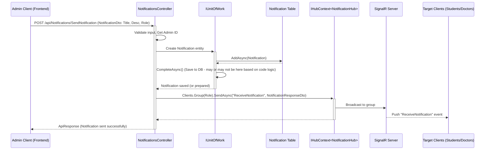
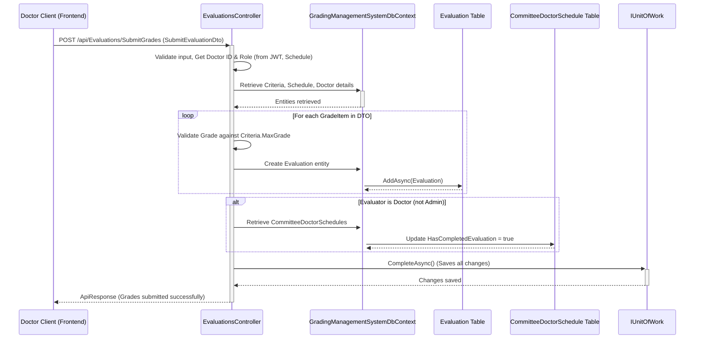

# Data Flow

This section describes the typical data flow for key operations within the Graduation Projects Grading System.

## 1. Student Registration and Email Verification

This flow outlines how a new student registers and verifies their email.

```mermaid
sequenceDiagram
    participant Client as Client (Frontend)
    participant AuthCtrl as AuthenticationController
    participant AuthService as IAuthenticationService
    participant TempUserDB as TemporaryUser Table
    participant OtpDB as UserOtp Table
    participant EmailSvc as IEmailService
    participant UserMgr as UserManager (ASP.NET Identity)
    participant StudentDB as Student Table
    participant AppUserDB as AppUser Table (Identity)

    Client->>+AuthCtrl: POST /api/Auth/StudentRegister (StudentRegisterDto)
    AuthCtrl->>+AuthService: RegisterStudentAsync(model)
    AuthService->>TempUserDB: Check if temporary user exists
    alt Temporary user exists (re-verification attempt)
        AuthService->>OtpDB: Delete existing OTP
        OtpDB-->>AuthService: OTP deleted
        AuthService->>OtpDB: Create new OTP
        OtpDB-->>AuthService: New OTP stored
        AuthService->>+EmailSvc: SendEmailAsync (OTP)
        EmailSvc-->>-AuthService: Email sent
        AuthService-->>-AuthCtrl: ApiResponse (OTP resent)
    else Temporary user does not exist (new registration)
        AuthService->>TempUserDB: Create TemporaryUser
        TempUserDB-->>AuthService: TemporaryUser created
        AuthService->>OtpDB: Create UserOtp (OTP, Expiry)
        OtpDB-->>AuthService: OTP stored
        AuthService->>+EmailSvc: SendEmailAsync (Welcome & OTP)
        EmailSvc-->>-AuthService: Email sent
        AuthService-->>-AuthCtrl: ApiResponse (Registration successful, OTP sent)
    end
    AuthCtrl-->>-Client: HTTP Response

    Client->>+AuthCtrl: POST /api/Auth/EmailVerificationByOtp/{otpCode}
    AuthCtrl->>+AuthService: VerifyEmailByOTPAsync(otpCode)
    AuthService->>OtpDB: Find OTP by code
    alt OTP valid and not expired
        AuthService->>TempUserDB: Find TemporaryUser by email from OTP
        AuthService->>+UserMgr: CreateAsync(AppUser from TemporaryUser)
        UserMgr-->>-AuthService: AppUser created (Identity)
        AuthService->>AppUserDB: (AppUser stored)
        AuthService->>+UserMgr: AddToRoleAsync(AppUser, "Student")
        UserMgr-->>-AuthService: Role assigned
        AuthService->>StudentDB: Create Student (links to AppUser)
        StudentDB-->>AuthService: Student created
        AuthService->>OtpDB: Delete OTP
        AuthService->>TempUserDB: Delete TemporaryUser
        AuthService-->>-AuthCtrl: ApiResponse (Email verified, Account created)
    else OTP invalid or expired
        AuthService-->>-AuthCtrl: ApiResponse (Error: OTP invalid/expired)
    end
    AuthCtrl-->>-Client: HTTP Response
```

**Steps:**
1.  **Student Initiates Registration**: Client sends student details (name, email, specialty, profile picture, password) to `AuthenticationController`.
2.  **Temporary Storage & OTP**: `AuthenticationService` checks for existing users. If none, it stores student data in `TemporaryUsers` table, generates an OTP, stores it in `UserOtps` table with an expiry time, and sends the OTP via `EmailService`.
3.  **Student Verifies OTP**: Client submits the received OTP to `AuthenticationController`.
4.  **Account Creation**: `AuthenticationService` validates the OTP. If valid:
    *   Creates an `AppUser` in ASP.NET Identity.
    *   Assigns the "Student" role.
    *   Creates a corresponding `Student` entity linked to the `AppUser`.
    *   Deletes the `TemporaryUser` record and the used OTP.
5.  Confirmation is sent to the client.

## 2. User Login

This flow describes how a registered user logs into the system.

```mermaid
sequenceDiagram
    participant Client as Client (Frontend)
    participant AuthCtrl as AuthenticationController
    participant AuthService as IAuthenticationService
    participant SignInMgr as SignInManager (ASP.NET Identity)
    participant UserMgr as UserManager (ASP.NET Identity)
    participant TokenSvc as ITokenService

    Client->>+AuthCtrl: POST /api/Auth/Login (LoginDto: Email, Password)
    AuthCtrl->>+AuthService: LoginAsync(model)
    AuthService->>+UserMgr: FindByEmailAsync(email)
    UserMgr-->>-AuthService: AppUser object (or null)
    alt User exists
        AuthService->>+SignInMgr: CheckPasswordSignInAsync(user, password)
        SignInMgr-->>-AuthService: SignInResult (Succeeded or Failed)
        alt Password correct
            AuthService->>+TokenSvc: CreateTokenAsync(user)
            TokenSvc-->>-AuthService: JWT Token
            AuthService-->>-AuthCtrl: ApiResponse (Login successful, Token)
        else Password incorrect
            AuthService-->>-AuthCtrl: ApiResponse (Error: Incorrect email/password)
        end
    else User does not exist
        AuthService-->>-AuthCtrl: ApiResponse (Error: Unauthorized)
    end
    AuthCtrl-->>-Client: HTTP Response (Token or Error)
```
**Steps:**
1.  **Client Sends Credentials**: User provides email and password.
2.  **Controller Receives**: `AuthenticationController` receives login request.
3.  **Service Authenticates**: `AuthenticationService` uses `UserManager` to find the user by email and `SignInManager` to validate the password.
4.  **Token Generation**: If credentials are valid, `TokenService` generates a JWT.
5.  **Token Returned**: The JWT is returned to the client for use in subsequent authenticated requests.

## 3. Admin Sends Notification

This flow shows how an administrator sends a notification to a group of users.



**Steps:**
1.  **Admin Initiates**: Admin client sends notification details (title, description, target role) to `NotificationsController`.
2.  **Controller Processes**:
    *   Validates input and retrieves the Admin's ID (from JWT claims).
    *   Creates a `Notification` entity.
    *   Saves the notification to the database via `IUnitOfWork`.
3.  **SignalR Broadcast**: The controller uses `IHubContext<NotificationHub>` to send the notification message to the specified client group (`Students`, `Doctors`, or `All`).
4.  **Clients Receive**: Connected clients belonging to the target group receive the notification in real-time via `NotificationHub`.

## 4. Doctor Submits Evaluation Grades

This flow illustrates how a doctor submits grades for a team or student.



**Steps:**
1.  **Doctor Submits Grades**: Doctor client sends evaluation data (schedule ID, team ID, optional student ID, list of criteria grades) to `EvaluationsController`.
2.  **Controller Authorization & Validation**:
    *   Authenticates the doctor and determines their role (Supervisor/Examiner) based on the schedule and JWT claims.
    *   Validates that the submitted grades are within the `MaxGrade` for each criterion.
3.  **Data Persistence**:
    *   For each grade item, a new `Evaluation` entity is created.
    *   These entities are added to the `GradingManagementSystemDbContext`.
4.  **Update Evaluation Status (for Doctors)**: If the evaluator is a Doctor, the corresponding `CommitteeDoctorSchedule` record is updated to mark `HasCompletedEvaluation` as true.
5.  **Save Changes**: `IUnitOfWork.CompleteAsync()` (or `_dbContext.SaveChangesAsync()`) is called to persist all changes to the database.
6.  Confirmation is sent to the client.

These flows represent common interactions. Other flows, such as project idea submission, team creation, and task management, follow similar patterns involving controllers, services, repositories, and the database.


