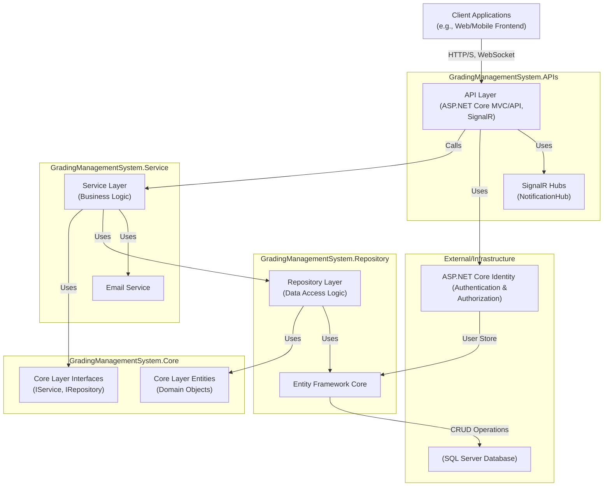
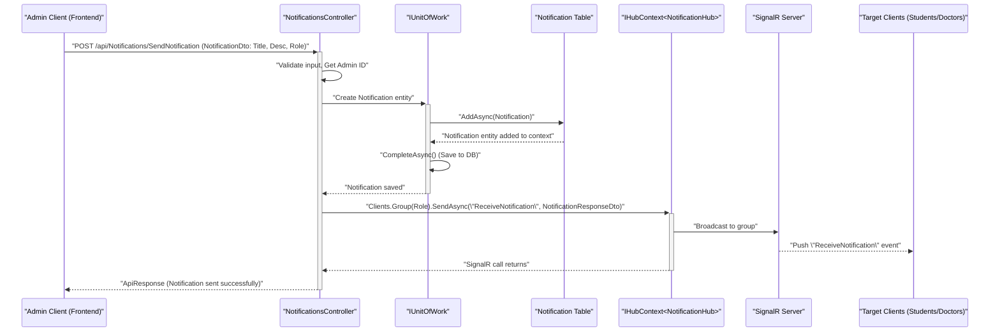
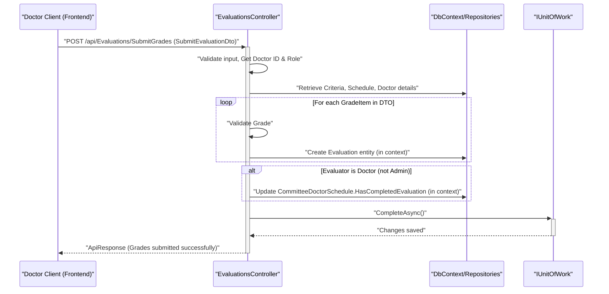
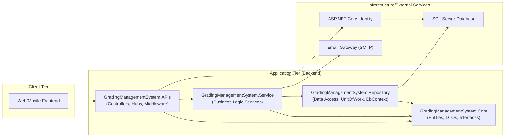

---PAGE: introduction.md---
# Introduction

Welcome to the documentation for the Graduation Projects Grading System. This system is a comprehensive backend solution designed to manage and streamline the processes involved in graduation project grading, including user management, project idea submissions, team formations, task assignments, scheduling, evaluations, and real-time notifications.

This documentation provides a detailed overview of the system's design, architecture, technologies used, data flow, and key components.

## Purpose

The primary purpose of this system is to:
*   Facilitate the management of academic years and terms.
*   Allow students, doctors, and administrators to interact with the system based on their roles.
*   Manage the submission and approval process for project ideas.
*   Enable team formation and management.
*   Support the creation and assignment of tasks to students.
*   Schedule and manage evaluation sessions.
*   Provide a flexible criteria-based evaluation mechanism.
*   Deliver real-time notifications to users.
*   Securely manage user profiles and authentication.

## Target Audience

This documentation is intended for:
*   **Developers**: To understand the system's architecture, codebase, and how to extend or maintain it.
*   **System Administrators**: To understand system setup, configuration, and deployment.
*   **Project Managers/Stakeholders**: To get an overview of the system's capabilities and design.

---PAGE: architecture.md---
# System Architecture

The Graduation Projects Grading System is built using a layered architecture, promoting separation of concerns, maintainability, and scalability.

## High-Level Architecture

The system follows a clean, n-tier architectural pattern:

1.  **API Layer (Presentation)**: Handles incoming HTTP requests, authentication, authorization, request validation, and responses. It interacts with the Service Layer.
    *   Located in `GradingManagementSystem.APIs` project.
    *   Key components: Controllers, SignalR Hubs, Middlewares, DTOs (for request/response shaping).
2.  **Service Layer (Business Logic)**: Contains the core business logic, orchestrates operations, and interacts with the Repository Layer.
    *   Located in `GradingManagementSystem.Service` project.
    *   Key components: Service classes (e.g., `AuthenticationService`, `UserProfileService`).
3.  **Repository Layer (Data Access)**: Abstracts the data persistence mechanism. It defines interfaces for data access and provides concrete implementations.
    *   Located in `GradingManagementSystem.Repository` project.
    *   Key components: Repository interfaces (in Core), Repository implementations, Entity Framework Core `DbContext`, Unit of Work pattern.
4.  **Core Layer (Domain)**: Contains the domain entities, DTOs (Data Transfer Objects), custom responses, and interfaces for services and repositories. This layer is central and has no dependencies on other layers.
    *   Located in `GradingManagementSystem.Core` project.
    *   Key components: Entities, DTOs, Repository and Service interfaces, Enum definitions.
5.  **Infrastructure/Shared Services**:
    *   **Database**: SQL Server is used for data persistence, managed via Entity Framework Core.
    *   **Identity**: ASP.NET Core Identity is used for user authentication and authorization.
    *   **Real-time Communication**: SignalR is used for sending real-time notifications.
    *   **Email Service**: For sending emails (e.g., OTP, password reset).



## Key Components

*   **`Program.cs`**: The main entry point for the API application. It configures services (Dependency Injection), the HTTP request pipeline (middleware), and initializes the application.
*   **Controllers (e.g., `AuthenticationController`, `ProjectsController`)**: Handle API requests for specific resources, validate input, call service methods, and return appropriate HTTP responses.
*   **Services (e.g., `IAuthenticationService`, `ITaskService`)**: Encapsulate business logic. They are injected into controllers.
*   **Repositories (e.g., `IGenericRepository<>`, `IProjectRepository`)**: Provide an abstraction layer over data storage. Implemented using Entity Framework Core.
*   **`UnitOfWork` (`IUnitOfWork`)**: Manages database transactions and coordinates changes across multiple repositories.
*   **Entities (e.g., `Student`, `Team`, `ProjectIdea`)**: Represent the domain objects and map to database tables.
*   **DTOs (Data Transfer Objects)**: Used to transfer data between layers, especially between the API and clients, and between services and controllers.
*   **`GradingManagementSystemDbContext`**: The Entity Framework Core DbContext class that manages database sessions, change tracking, and persistence.
*   **`NotificationHub`**: A SignalR hub responsible for real-time communication, primarily for sending notifications to connected clients based on their roles.
*   **ASP.NET Core Identity (`AppUser`, `UserManager`, `SignInManager`, `RoleManager`)**: Handles user registration, login, roles, and security.
*   **Middleware (`ExceptionMiddleware`)**: Custom middleware for global exception handling, ensuring consistent error responses.
*   **Extensions (`ApplicationServicesExtension`, `IdentityServicesExtension`)**: Static classes used to organize service registration and configuration in `Program.cs`.

This layered approach ensures that each part of the system has a distinct responsibility, making the application easier to develop, test, and maintain.

---PAGE: technologies.md---
# Technologies Used

The Graduation Projects Grading System leverages a modern .NET technology stack and common software development patterns.

## Core Framework & Platform

*   **.NET 8**: The primary framework for building the application. (Identified from `.NETCoreApp,Version=v8.0.AssemblyAttributes.cs`)
*   **ASP.NET Core 8**: Used for building the web API, handling HTTP requests, routing, and middleware.

## Data Access

*   **Entity Framework Core**: The Object-Relational Mapper (ORM) used for interacting with the database. It simplifies data access operations and database schema management. (Identified from `Microsoft.EntityFrameworkCore` namespace and `GradingManagementSystemDbContext`).
*   **SQL Server**: The relational database management system used for storing application data. (Implied by `options.UseSqlServer` in `ApplicationServicesExtension.cs` and connection string name "MonsterConnection" or "DefaultConnection").
*   **Repository Pattern**: Used to abstract data access logic, promoting testability and separation of concerns. (Identified by `IGenericRepository<>` and its implementations).
*   **Unit of Work Pattern**: Used to manage transactions and ensure data consistency across multiple repository operations. (Identified by `IUnitOfWork` and its implementation).

## Authentication & Authorization

*   **ASP.NET Core Identity**: Provides a comprehensive membership system for managing users, passwords, roles, and claims. (Identified from `Microsoft.AspNetCore.Identity` namespace and `IdentityServicesExtension.cs`).
*   **JSON Web Tokens (JWT)**: Used for stateless, token-based authentication. The system generates JWTs upon successful login, which clients then include in subsequent requests. (Identified from `AddJwtBearer` configuration in `IdentityServicesExtension.cs` and `ITokenService`).

## Real-time Communication

*   **SignalR**: Used for enabling real-time, bi-directional communication between the server and clients, primarily for notifications. (Identified from `Microsoft.AspNetCore.SignalR` namespace, `NotificationHub.cs`, and `app.MapHub<NotificationHub>`).

## API & Development Tools

*   **Swagger (OpenAPI)**: Used for designing, building, documenting, and consuming RESTful APIs. The system integrates Swashbuckle to automatically generate Swagger UI. (Identified from `AddSwaggerGen` in `ApplicationServicesExtension.cs` and `app.UseSwagger()`).
*   **Dependency Injection (DI)**: Heavily used throughout the ASP.NET Core application to manage dependencies and promote loose coupling. (Evident in `Program.cs` service configuration).
*   **CORS (Cross-Origin Resource Sharing)**: Configured to allow requests from specified client origins (e.g., `http://localhost:4200`, `https://graduation-project-angular.vercel.app`). (Identified in `Program.cs`).

## Email Communication

*   **SMTP**: Used for sending emails (e.g., OTP for email verification, password reset links). (Identified by `System.Net.Mail.SmtpClient` in `EmailService.cs` and email settings in configuration).

## Coding Patterns & Practices

*   **Layered Architecture**: Separates concerns into API, Service, Repository, and Core layers.
*   **Async/Await**: Extensively used for non-blocking I/O operations, improving application responsiveness and scalability.
*   **DTOs (Data Transfer Objects)**: Used for shaping data passed between layers and to/from clients.
*   **Custom Middleware**: For tasks like global exception handling (`ExceptionMiddleware.cs`).
*   **Configuration Management**: Utilizes ASP.NET Core's configuration system (e.g., `IConfiguration`).

This combination of technologies and patterns provides a robust, scalable, and maintainable foundation for the Graduation Projects Grading System.

---PAGE: data_flow.md---
# Data Flow

This section describes the typical data flow for key operations within the Graduation Projects Grading System.

## 1. Student Registration and Email Verification

This flow outlines how a new student registers and verifies their email.

```mermaid
sequenceDiagram
    participant Client as "Client (Frontend)"
    participant AuthCtrl as "AuthenticationController"
    participant AuthService as "IAuthenticationService"
    participant TempUserDB as "TemporaryUser Table"
    participant OtpDB as "UserOtp Table"
    participant EmailSvc as "IEmailService"
    participant UserMgr as "UserManager (ASP.NET Identity)"
    participant StudentDB as "Student Table"
    participant AppUserDB as "AppUser Table (Identity)"

    Client->>+AuthCtrl: "POST /api/Auth/StudentRegister (StudentRegisterDto)"
    AuthCtrl->>+AuthService: "RegisterStudentAsync(model)"
    AuthService->>TempUserDB: "Check if temporary user exists"
    alt Temporary user exists (re-verification attempt)
        AuthService->>OtpDB: "Delete existing OTP"
        OtpDB-->>AuthService: "OTP deleted"
        AuthService->>OtpDB: "Create new OTP"
        OtpDB-->>AuthService: "New OTP stored"
        AuthService->>+EmailSvc: "SendEmailAsync (OTP)"
        EmailSvc-->>-AuthService: "Email sent"
        AuthService-->>-AuthCtrl: "ApiResponse (OTP resent)"
    else Temporary user does not exist (new registration)
        AuthService->>TempUserDB: "Create TemporaryUser"
        TempUserDB-->>AuthService: "TemporaryUser created"
        AuthService->>OtpDB: "Create UserOtp (OTP, Expiry)"
        OtpDB-->>AuthService: "OTP stored"
        AuthService->>+EmailSvc: "SendEmailAsync (Welcome & OTP)"
        EmailSvc-->>-AuthService: "Email sent"
        AuthService-->>-AuthCtrl: "ApiResponse (Registration successful, OTP sent)"
    end
    AuthCtrl-->>-Client: "HTTP Response"

    Client->>+AuthCtrl: "POST /api/Auth/EmailVerificationByOtp/{otpCode}"
    AuthCtrl->>+AuthService: "VerifyEmailByOTPAsync(otpCode)"
    AuthService->>OtpDB: "Find OTP by code"
    alt OTP valid and not expired
        AuthService->>TempUserDB: "Find TemporaryUser by email from OTP"
        AuthService->>+UserMgr: "CreateAsync(AppUser from TemporaryUser)"
        UserMgr-->>-AuthService: "AppUser created (Identity)"
        AuthService->>AppUserDB: "(AppUser stored)"
        AuthService->>+UserMgr: "AddToRoleAsync(AppUser, \"Student\")"
        UserMgr-->>-AuthService: "Role assigned"
        AuthService->>StudentDB: "Create Student (links to AppUser)"
        StudentDB-->>AuthService: "Student created"
        AuthService->>OtpDB: "Delete OTP"
        AuthService->>TempUserDB: "Delete TemporaryUser"
        AuthService-->>-AuthCtrl: "ApiResponse (Email verified, Account created)"
    else OTP invalid or expired
        AuthService-->>-AuthCtrl: "ApiResponse (Error: OTP invalid/expired)"
    end
    AuthCtrl-->>-Client: "HTTP Response"
```

**Steps:**
1.  **Student Initiates Registration**: Client sends student details (name, email, specialty, profile picture, password) to `AuthenticationController`.
2.  **Temporary Storage & OTP**: `AuthenticationService` checks for existing users. If none, it stores student data in `TemporaryUsers` table, generates an OTP, stores it in `UserOtps` table with an expiry time, and sends the OTP via `EmailService`.
3.  **Student Verifies OTP**: Client submits the received OTP to `AuthenticationController`.
4.  **Account Creation**: `AuthenticationService` validates the OTP. If valid:
    *   Creates an `AppUser` in ASP.NET Identity.
    *   Assigns the "Student" role.
    *   Creates a corresponding `Student` entity linked to the `AppUser`.
    *   Deletes the `TemporaryUser` record and the used OTP.
5.  Confirmation is sent to the client.

## 2. User Login

This flow describes how a registered user logs into the system.

```mermaid
sequenceDiagram
    participant Client as "Client (Frontend)"
    participant AuthCtrl as "AuthenticationController"
    participant AuthService as "IAuthenticationService"
    participant SignInMgr as "SignInManager (ASP.NET Identity)"
    participant UserMgr as "UserManager (ASP.NET Identity)"
    participant TokenSvc as "ITokenService"

    Client->>+AuthCtrl: "POST /api/Auth/Login (LoginDto: Email, Password)"
    AuthCtrl->>+AuthService: "LoginAsync(model)"
    AuthService->>+UserMgr: "FindByEmailAsync(email)"
    UserMgr-->>-AuthService: "AppUser object (or null)"
    alt User exists
        AuthService->>+SignInMgr: "CheckPasswordSignInAsync(user, password)"
        SignInMgr-->>-AuthService: "SignInResult (Succeeded or Failed)"
        alt Password correct
            AuthService->>+TokenSvc: "CreateTokenAsync(user)"
            TokenSvc-->>-AuthService: "JWT Token"
            AuthService-->>-AuthCtrl: "ApiResponse (Login successful, Token)"
        else Password incorrect
            AuthService-->>-AuthCtrl: "ApiResponse (Error: Incorrect email/password)"
        end
    else User does not exist
        AuthService-->>-AuthCtrl: "ApiResponse (Error: Unauthorized)"
    end
    AuthCtrl-->>-Client: "HTTP Response (Token or Error)"
```
**Steps:**
1.  **Client Sends Credentials**: User provides email and password.
2.  **Controller Receives**: `AuthenticationController` receives login request.
3.  **Service Authenticates**: `AuthenticationService` uses `UserManager` to find the user by email and `SignInManager` to validate the password.
4.  **Token Generation**: If credentials are valid, `TokenService` generates a JWT.
5.  **Token Returned**: The JWT is returned to the client for use in subsequent authenticated requests.

## 3. Admin Sends Notification

This flow shows how an administrator sends a notification to a group of users.



**Steps:**
1.  **Admin Initiates**: Admin client sends notification details (title, description, target role) to `NotificationsController`.
2.  **Controller Processes**:
    *   Validates input and retrieves the Admin's ID (from JWT claims).
    *   Creates a `Notification` entity.
    *   Saves the notification to the database via `IUnitOfWork`.
3.  **SignalR Broadcast**: The controller uses `IHubContext<NotificationHub>` to send the notification message to the specified client group (`Students`, `Doctors`, or `All`).
4.  **Clients Receive**: Connected clients belonging to the target group receive the notification in real-time via `NotificationHub`.

## 4. Doctor Submits Evaluation Grades

This flow illustrates how a doctor submits grades for a team or student.



**Steps:**
1.  **Doctor Submits Grades**: Doctor client sends evaluation data (schedule ID, team ID, optional student ID, list of criteria grades) to `EvaluationsController`.
2.  **Controller Authorization & Validation**:
    *   Authenticates the doctor and determines their role (Supervisor/Examiner) based on the schedule and JWT claims.
    *   Validates that the submitted grades are within the `MaxGrade` for each criterion.
3.  **Data Persistence**:
    *   For each grade item, a new `Evaluation` entity is created and added to the DbContext.
4.  **Update Evaluation Status (for Doctors)**: If the evaluator is a Doctor, the corresponding `CommitteeDoctorSchedule` record is updated in the DbContext to mark `HasCompletedEvaluation` as true.
5.  **Save Changes**: `IUnitOfWork.CompleteAsync()` is called to persist all changes to the database.
6.  Confirmation is sent to the client.

These flows represent common interactions. Other flows, such as project idea submission, team creation, and task management, follow similar patterns involving controllers, services, repositories, and the database.

---PAGE: uml_diagrams.md---
# UML Diagrams

This section provides various UML diagrams to visualize the system's structure, relationships, and interactions.

## 1. Component Diagram

This diagram shows the high-level components of the system and their dependencies.



## 2. Simplified Class Diagram (Key Entities)

This diagram illustrates the main entities and their relationships. For brevity, not all attributes or methods are shown.


## 3. Sequence Diagram: Student Registration

This diagram shows the sequence of interactions for a new student registration.
(Refer to Data Flow section for the Mermaid diagram, as it's already detailed there.)

## 4. Sequence Diagram: Admin Sends Notification

This diagram shows the sequence of interactions when an admin sends a notification.
(Refer to Data Flow section for the Mermaid diagram, as it's already detailed there.)

## 5. Use Case Diagram

This diagram illustrates the main functionalities (use cases) available to different actors (Admin, Doctor, Student).

```mermaid
usecaseDiagram
    actor Admin
    actor Doctor
    actor Student

    rectangle "Graduation Project Grading System" {
        Admin -- (Manage Academic Appointments)
        Admin -- (Manage Evaluation Criteria)
        Admin -- (Manage User Accounts)
        Admin -- (Review Project Ideas)
        Admin -- (Assign Supervisors to Teams)
        Admin -- (Send Notifications)
        Admin -- (Evaluate Teams/Students)
        Admin -- (Create Schedules)
        Admin -- (View All Projects)
        Admin -- (View All Teams)

        Doctor -- (Login)
        Doctor -- (Manage Profile)
        Doctor -- (Submit Project Ideas)
        Doctor -- (View Own Project Ideas)
        Doctor -- (Review Team Requests for Own Projects)
        Doctor -- (Supervise Teams)
        Doctor -- (Create Tasks for Teams)
        Doctor -- (Review Student Tasks)
        Doctor -- (Evaluate Teams/Students in Schedules)
        Doctor -- (View Assigned Schedules)
        Doctor -- (View Notifications)

        Student -- (Register)
        Student -- (Verify Email)
        Student -- (Login)
        Student -- (Manage Profile)
        Student -- (Create Team)
        Student -- (Invite Members to Team)
        Student -- (Respond to Team Invitations)
        Student -- (Submit Team Project Idea)
        Student -- (Request Doctor's Project Idea)
        Student -- (View Available Project Ideas)
        Student -- (View Team Tasks)
        Student -- (View Own Grades)
        Student -- (View Schedules)
        Student -- (View Notifications)

        (Login) .> (Manage Profile) : "<<includes>>"
        (Manage Academic Appointments) ..> Admin
        (Manage Evaluation Criteria) ..> Admin
        (Send Notifications) ..> Admin
        (Evaluate Teams/Students) ..> Admin
        (Evaluate Teams/Students in Schedules) ..> Doctor
        (Supervise Teams) ..> Doctor
    }
```

These diagrams provide a visual understanding of the system's components, entity relationships, and key interaction flows. For more detailed sequence diagrams of other specific flows, refer to the Data Flow section or analyze the respective controller and service interactions.

---PAGE: database_schema.md---
# Database Schema Overview

The database schema is designed using Entity Framework Core, employing a code-first approach. Key entities and their relationships define the structure of the SQL Server database.

## Core Entities and Relationships

The following are the primary entities and their significant relationships. For a visual representation, please see the Simplified Class Diagram in the [UML Diagrams](uml_diagrams.md) section.

*   **`AppUser` (Identity)**:
    *   Stores core user information for authentication (username, email, password hash).
    *   Base for specific user roles.
    *   Relationships:
        *   One-to-One with `Admin`, `Doctor`, or `Student`.

*   **`Admin`**:
    *   Represents an administrator user.
    *   Linked to `AppUser`.
    *   Relationships:
        *   One-to-Many with `Notification` (Admin sends notifications).
        *   One-to-Many with `Evaluation` (Admin can be an evaluator).

*   **`Doctor`**:
    *   Represents a doctor/faculty member.
    *   Linked to `AppUser`.
    *   Relationships:
        *   One-to-Many with `DoctorProjectIdea` (Doctor submits project ideas).
        *   One-to-Many with `Team` (as Supervisor).
        *   One-to-Many with `TaskItem` (as Supervisor assigning tasks).
        *   Many-to-Many with `Schedule` via `CommitteeDoctorSchedule` (as Examiner/Supervisor).
        *   One-to-Many with `Evaluation` (Doctor can be an evaluator).

*   **`Student`**:
    *   Represents a student user.
    *   Linked to `AppUser`.
    *   Relationships:
        *   Many-to-One with `Team` (Student is a member of a team).
        *   One-to-One with `Team` (Student can be a leader of a team).
        *   One-to-Many with `TeamProjectIdea` (as Leader submitting project ideas).
        *   Many-to-Many with `TaskItem` via `TaskMember`.
        *   One-to-Many with `Evaluation` (Student receives evaluations).

*   **`Team`**:
    *   Represents a student team.
    *   Relationships:
        *   One-to-Many with `Student` (Team has members).
        *   One-to-One with `Student` (Team has a leader).
        *   Many-to-One with `Doctor` (Team is supervised by a doctor).
        *   One-to-Many with `TeamProjectIdea`.
        *   One-to-One with `FinalProjectIdea`.
        *   One-to-Many with `Schedule`.
        *   One-to-Many with `TaskItem`.
        *   One-to-Many with `Invitation` (Team sends invitations).

*   **Project Ideas**:
    *   `DoctorProjectIdea`: Submitted by a `Doctor`.
    *   `TeamProjectIdea`: Submitted by a `Student` (Team Leader) for their `Team`.
    *   `FinalProjectIdea`: The approved project idea for a `Team`, linked to either a `DoctorProjectIdea` or `TeamProjectIdea` and a `Supervisor` (`Doctor`).

*   **`AcademicAppointment`**:
    *   Defines academic years and term dates (e.g., "2023-2024", First Term Start/End).
    *   Relationships:
        *   One-to-Many with `Criteria`.
        *   One-to-Many with `Schedule`.

*   **`Criteria`**:
    *   Defines evaluation criteria (name, description, max grade, evaluator type, target).
    *   Linked to an `AcademicAppointment`.
    *   Relationships:
        *   One-to-Many with `Evaluation`.
        *   Many-to-Many with `Schedule` via `CriteriaSchedule`.

*   **`Schedule`**:
    *   Defines evaluation/presentation schedules for teams.
    *   Linked to a `Team` and an `AcademicAppointment`.
    *   Relationships:
        *   One-to-Many with `CommitteeDoctorSchedule` (linking Doctors as examiners/supervisors).
        *   One-to-Many with `Evaluation`.
        *   Many-to-Many with `Criteria` via `CriteriaSchedule`.

*   **`Evaluation`**:
    *   Stores grades given during evaluations.
    *   Linked to `Schedule`, `Criteria`, an evaluator (`Admin` or `Doctor`), and a recipient (`Student` or `Team`).

*   **Tasks**:
    *   `TaskItem`: A task assigned by a `Doctor` (Supervisor) to a `Team`.
    *   `TaskMember`: Links a `TaskItem` to specific `Student`s within the team, tracking their status.

*   **`Notification`**:
    *   Stores notifications sent by `Admin`s to specific roles (`Students`, `Doctors`, `All`).

*   **`Invitation`**:
    *   Represents an invitation from a `Team` (Leader) to a `Student` to join the team.

*   **Auxiliary Entities**:
    *   `UserOtp`: Stores OTPs for email verification, linked to user email.
    *   `TemporaryUser`: Stores student registration data before email verification.
    *   `CommitteeDoctorSchedule`: Join table for `Schedule` and `Doctor`, defining the doctor's role in the schedule.
    *   `CriteriaSchedule`: Join table for `Criteria` and `Schedule`.

## Database Context

*   **`GradingManagementSystemDbContext.cs`**: This class, inheriting from `IdentityDbContext<AppUser, IdentityRole, string>`, is the Entity Framework Core context. It defines `DbSet` properties for each entity, representing tables in the database. Configuration for entities (like relationships, constraints) is applied in the `OnModelCreating` method, often by loading configurations from separate classes (e.g., `AdminConfigurations`, `TeamConfigurations`).

## Migrations

*   Database schema changes are managed using EF Core Migrations. The `GradingManagementSystem.Repository/Data/Migrations` folder contains migration files that track changes to the model and allow updating the database schema accordingly.

This schema facilitates the complex interactions and data storage requirements of the Graduation Projects Grading System.

---PAGE: system_setup_and_services.md---
# System Setup and Services

This page details the setup process in `Program.cs` and the core services configured for the application.

## Application Startup (`Program.cs`)

The `Program.cs` file is the entry point of the ASP.NET Core application. It's responsible for:
1.  Creating a `WebApplicationBuilder`.
2.  Configuring services for dependency injection.
3.  Building the `WebApplication`.
4.  Configuring the HTTP request pipeline (middleware).
5.  Running the application.

### Service Configuration

Key services are registered in the `Main` method, primarily through extension methods:

*   **`builder.Services.AddApplicationServices(builder.Configuration)`**: (Defined in `ApplicationServicesExtension.cs`)
    *   **Database Context**: Registers `GradingManagementSystemDbContext` with SQL Server.
        ```csharp
        Services.AddDbContext<GradingManagementSystemDbContext>(options =>
        {
            options.UseSqlServer(configuration.GetConnectionString("DefaultConnection")); // Or "MonsterConnection"
        });
        ```
    *   **Controllers & API Behavior**: Adds controller services and configures API behavior options, including custom handling for invalid model states to return a structured `ApiResponse`.
    *   **API Explorer & Swagger**: Configures Swagger/OpenAPI for API documentation, including JWT bearer token authentication support in Swagger UI.
    *   **Repositories**: Registers generic and specific repository implementations (e.g., `IGenericRepository<>`, `INotificationRepository`, `IProjectRepository`).
        ```csharp
        Services.AddScoped(typeof(IGenericRepository<>), typeof(GenericRepository<>));
        Services.AddScoped<INotificationRepository, NotificationRepository>();
        // ... other repositories
        ```
    *   **Unit of Work**: Registers `IUnitOfWork`.
        ```csharp
        Services.AddScoped<IUnitOfWork, UnitOfWork>();
        ```
    *   **Business Services**: Registers application services (e.g., `IAuthenticationService`, `IEmailService`, `ITaskService`, `ITokenService`, `IUserProfileService`).
        ```csharp
        Services.AddScoped<IAuthenticationService, AuthenticationService>();
        Services.AddScoped<IEmailService, EmailService>();
        // ... other services
        ```
    *   **SignalR**: Adds SignalR services.
        ```csharp
        Services.AddSignalR();
        ```

*   **`builder.Services.AddIdentityServices(builder.Configuration)`**: (Defined in `IdentityServicesExtension.cs`)
    *   **ASP.NET Core Identity**: Configures IdentityCore for `AppUser` and `IdentityRole`, using `GradingManagementSystemDbContext` for storage.
        ```csharp
        Services.AddIdentityCore<AppUser>().AddRoles<IdentityRole>()
            .AddEntityFrameworkStores<GradingManagementSystemDbContext>()
            .AddSignInManager<SignInManager<AppUser>>()
            .AddRoleManager<RoleManager<IdentityRole>>()
            .AddDefaultTokenProviders();
        ```
    *   **Data Protection Token Provider**: Configures token lifespan (e.g., for password reset).
    *   **JWT Authentication**: Configures JWT bearer authentication scheme with token validation parameters (issuer, audience, lifetime, signing key).

*   **CORS Configuration**:
    *   Defines a CORS policy named "CorsPolicy" allowing specific origins (`http://localhost:4200`, `https://graduation-project-angular.vercel.app`), any header, any method, and credentials.
    ```csharp
    builder.Services.AddCors(options =>
    {
        options.AddPolicy("CorsPolicy", policy =>
        {
            policy.WithOrigins("http://localhost:4200", "https://graduation-project-angular.vercel.app")
                  .AllowAnyHeader()
                  .AllowAnyMethod()
                  .AllowCredentials();
        });
    });
    ```

### Database Migration and Seeding

After building the app (`var app = builder.Build();`), the system attempts to:
1.  **Apply Database Migrations Automatically**:
    ```csharp
    var _dbContext = services.GetRequiredService<GradingManagementSystemDbContext>();
    await _dbContext.Database.MigrateAsync();
    ```
2.  **Seed Initial Data**: Calls `SeedData.SeedRolesAndAdminUsersAsync` to create default roles ("Admin", "Doctor", "Student") and predefined admin users if they don't exist.

### HTTP Request Pipeline Configuration (Middleware)

The order of middleware registration is crucial:

1.  **`app.MapHub<NotificationHub>("/api/notificationHub")`**: Maps the SignalR `NotificationHub` to the specified endpoint.
2.  **`app.UseMiddleware<ExceptionMiddleware>()`**: Adds custom global exception handling.
3.  **Swagger**:
    *   `app.UseSwagger()`: Enables the Swagger JSON endpoint.
    *   `app.UseSwaggerUI()`: Enables the Swagger UI.
4.  **`app.UseHttpsRedirection()`**: Redirects HTTP requests to HTTPS.
5.  **`app.UseStaticFiles()`**: Enables serving static files (e.g., profile pictures from `wwwroot`).
6.  **`app.UseCors("CorsPolicy")`**: Applies the configured CORS policy.
7.  **`app.UseRouting()`**: Adds route matching to the pipeline.
8.  **`app.UseAuthentication()`**: Adds authentication middleware (validates JWTs).
9.  **`app.UseAuthorization()`**: Adds authorization middleware (checks if authenticated users have required roles/policies).
10. **`app.MapControllers()`**: Maps attribute-routed controllers.

Finally, `app.Run()` starts the application and listens for incoming HTTP requests.

This setup ensures that all necessary services are available via DI and the request pipeline is configured correctly to handle requests, authentication, routing, and real-time communication.
