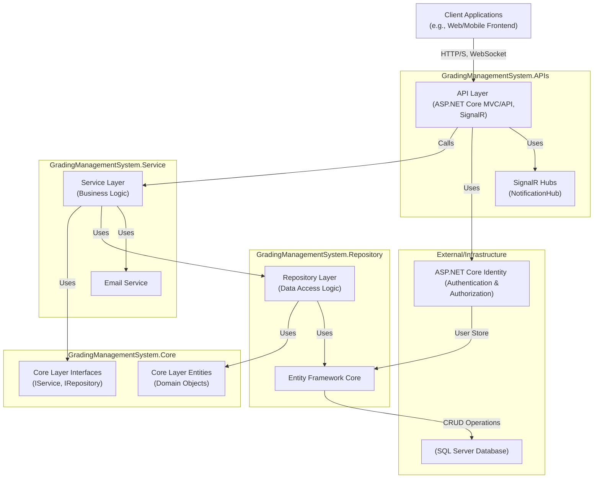
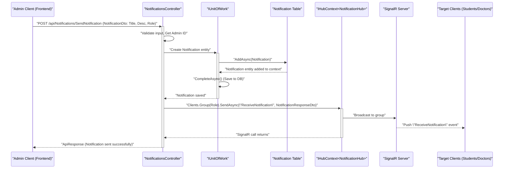
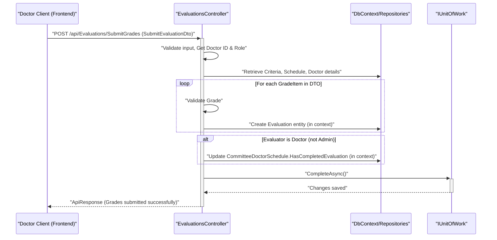
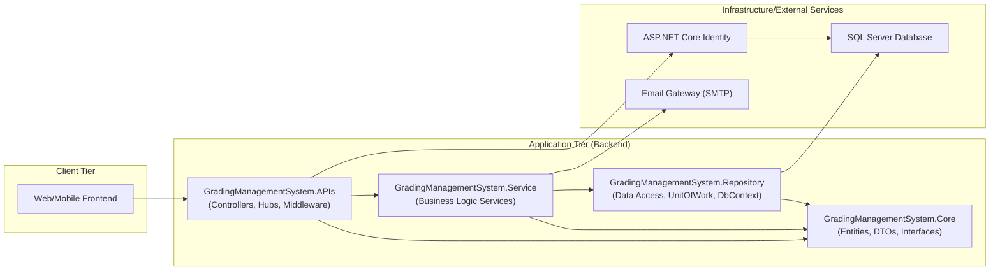
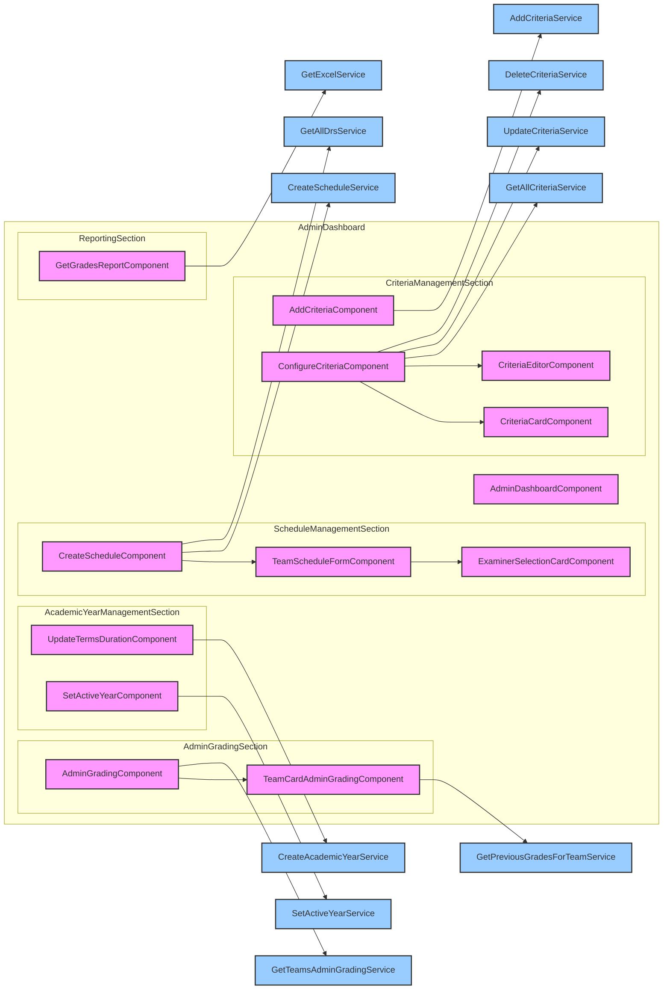
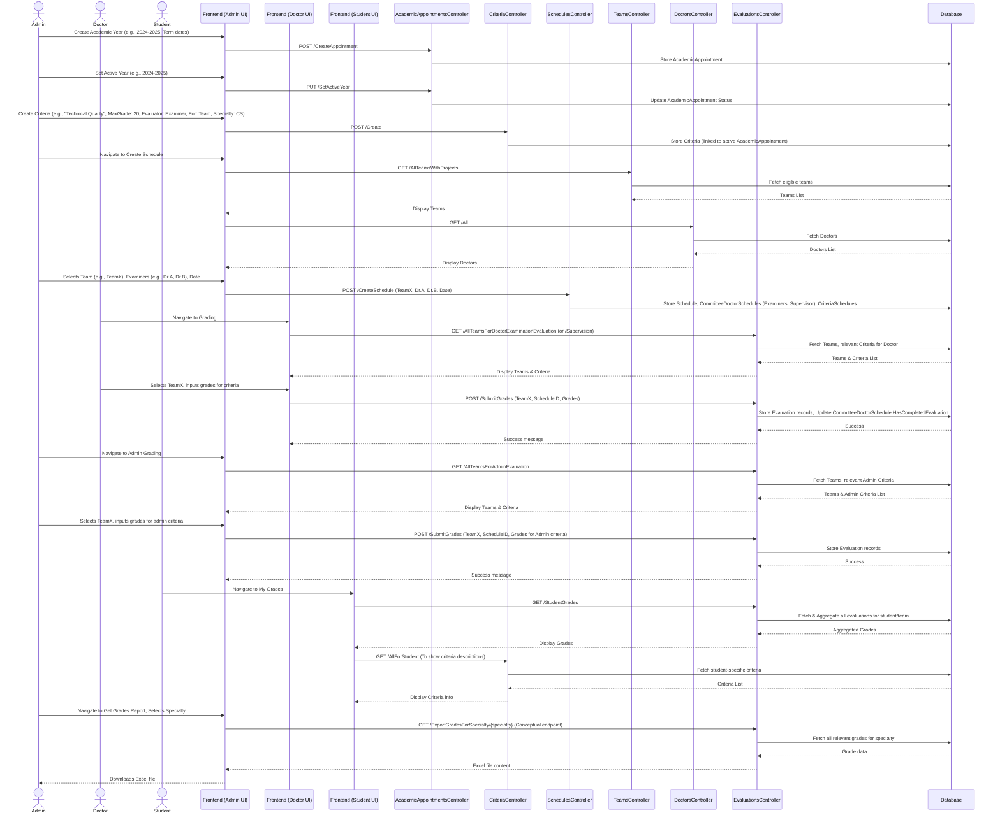
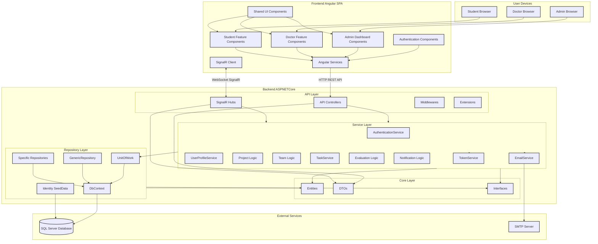

---PAGE: introduction.md---
# Introduction

Welcome to the documentation for the Graduation Projects Grading System. This system is a comprehensive backend solution designed to manage and streamline the processes involved in graduation project grading, including user management, project idea submissions, team formations, task assignments, scheduling, evaluations, and real-time notifications.

This documentation provides a detailed overview of the system's design, architecture, technologies used, data flow, and key components.

## Purpose

The primary purpose of this system is to:
*   Facilitate the management of academic years and terms.
*   Allow students, doctors, and administrators to interact with the system based on their roles.
*   Manage the submission and approval process for project ideas.
*   Enable team formation and management.
*   Support the creation and assignment of tasks to students.
*   Schedule and manage evaluation sessions.
*   Provide a flexible criteria-based evaluation mechanism.
*   Deliver real-time notifications to users.
*   Securely manage user profiles and authentication.

## Target Audience

This documentation is intended for:
*   **Developers**: To understand the system's architecture, codebase, and how to extend or maintain it.
*   **System Administrators**: To understand system setup, configuration, and deployment.
*   **Project Managers/Stakeholders**: To get an overview of the system's capabilities and design.

---PAGE: architecture.md---
# System Architecture

The Graduation Projects Grading System is built using a layered architecture, promoting separation of concerns, maintainability, and scalability.

## High-Level Architecture

The system follows a clean, n-tier architectural pattern:

1.  **API Layer (Presentation)**: Handles incoming HTTP requests, authentication, authorization, request validation, and responses. It interacts with the Service Layer.
    *   Located in `GradingManagementSystem.APIs` project.
    *   Key components: Controllers, SignalR Hubs, Middlewares, DTOs (for request/response shaping).
2.  **Service Layer (Business Logic)**: Contains the core business logic, orchestrates operations, and interacts with the Repository Layer.
    *   Located in `GradingManagementSystem.Service` project.
    *   Key components: Service classes (e.g., `AuthenticationService`, `UserProfileService`).
3.  **Repository Layer (Data Access)**: Abstracts the data persistence mechanism. It defines interfaces for data access and provides concrete implementations.
    *   Located in `GradingManagementSystem.Repository` project.
    *   Key components: Repository interfaces (in Core), Repository implementations, Entity Framework Core `DbContext`, Unit of Work pattern.
4.  **Core Layer (Domain)**: Contains the domain entities, DTOs (Data Transfer Objects), custom responses, and interfaces for services and repositories. This layer is central and has no dependencies on other layers.
    *   Located in `GradingManagementSystem.Core` project.
    *   Key components: Entities, DTOs, Repository and Service interfaces, Enum definitions.
5.  **Infrastructure/Shared Services**:
    *   **Database**: SQL Server is used for data persistence, managed via Entity Framework Core.
    *   **Identity**: ASP.NET Core Identity is used for user authentication and authorization.
    *   **Real-time Communication**: SignalR is used for sending real-time notifications.
    *   **Email Service**: For sending emails (e.g., OTP, password reset).



## Key Components

*   **`Program.cs`**: The main entry point for the API application. It configures services (Dependency Injection), the HTTP request pipeline (middleware), and initializes the application.
*   **Controllers (e.g., `AuthenticationController`, `ProjectsController`)**: Handle API requests for specific resources, validate input, call service methods, and return appropriate HTTP responses.
*   **Services (e.g., `IAuthenticationService`, `ITaskService`)**: Encapsulate business logic. They are injected into controllers.
*   **Repositories (e.g., `IGenericRepository<>`, `IProjectRepository`)**: Provide an abstraction layer over data storage. Implemented using Entity Framework Core.
*   **`UnitOfWork` (`IUnitOfWork`)**: Manages database transactions and coordinates changes across multiple repositories.
*   **Entities (e.g., `Student`, `Team`, `ProjectIdea`)**: Represent the domain objects and map to database tables.
*   **DTOs (Data Transfer Objects)**: Used to transfer data between layers, especially between the API and clients, and between services and controllers.
*   **`GradingManagementSystemDbContext`**: The Entity Framework Core DbContext class that manages database sessions, change tracking, and persistence.
*   **`NotificationHub`**: A SignalR hub responsible for real-time communication, primarily for sending notifications to connected clients based on their roles.
*   **ASP.NET Core Identity (`AppUser`, `UserManager`, `SignInManager`, `RoleManager`)**: Handles user registration, login, roles, and security.
*   **Middleware (`ExceptionMiddleware`)**: Custom middleware for global exception handling, ensuring consistent error responses.
*   **Extensions (`ApplicationServicesExtension`, `IdentityServicesExtension`)**: Static classes used to organize service registration and configuration in `Program.cs`.

This layered approach ensures that each part of the system has a distinct responsibility, making the application easier to develop, test, and maintain.

---PAGE: technologies.md---
# Technologies Used

The Graduation Projects Grading System leverages a modern .NET technology stack and common software development patterns.

## Core Framework & Platform

*   **.NET 8**: The primary framework for building the application. (Identified from `.NETCoreApp,Version=v8.0.AssemblyAttributes.cs`)
*   **ASP.NET Core 8**: Used for building the web API, handling HTTP requests, routing, and middleware.

## Data Access

*   **Entity Framework Core**: The Object-Relational Mapper (ORM) used for interacting with the database. It simplifies data access operations and database schema management. (Identified from `Microsoft.EntityFrameworkCore` namespace and `GradingManagementSystemDbContext`).
*   **SQL Server**: The relational database management system used for storing application data. (Implied by `options.UseSqlServer` in `ApplicationServicesExtension.cs` and connection string name "MonsterConnection" or "DefaultConnection").
*   **Repository Pattern**: Used to abstract data access logic, promoting testability and separation of concerns. (Identified by `IGenericRepository<>` and its implementations).
*   **Unit of Work Pattern**: Used to manage transactions and ensure data consistency across multiple repository operations. (Identified by `IUnitOfWork` and its implementation).

## Authentication & Authorization

*   **ASP.NET Core Identity**: Provides a comprehensive membership system for managing users, passwords, roles, and claims. (Identified from `Microsoft.AspNetCore.Identity` namespace and `IdentityServicesExtension.cs`).
*   **JSON Web Tokens (JWT)**: Used for stateless, token-based authentication. The system generates JWTs upon successful login, which clients then include in subsequent requests. (Identified from `AddJwtBearer` configuration in `IdentityServicesExtension.cs` and `ITokenService`).

## Real-time Communication

*   **SignalR**: Used for enabling real-time, bi-directional communication between the server and clients, primarily for notifications. (Identified from `Microsoft.AspNetCore.SignalR` namespace, `NotificationHub.cs`, and `app.MapHub<NotificationHub>`).

## API & Development Tools

*   **Swagger (OpenAPI)**: Used for designing, building, documenting, and consuming RESTful APIs. The system integrates Swashbuckle to automatically generate Swagger UI. (Identified from `AddSwaggerGen` in `ApplicationServicesExtension.cs` and `app.UseSwagger()`).
*   **Dependency Injection (DI)**: Heavily used throughout the ASP.NET Core application to manage dependencies and promote loose coupling. (Evident in `Program.cs` service configuration).
*   **CORS (Cross-Origin Resource Sharing)**: Configured to allow requests from specified client origins (e.g., `http://localhost:4200`, `https://graduation-project-angular.vercel.app`). (Identified in `Program.cs`).

## Email Communication

*   **SMTP**: Used for sending emails (e.g., OTP for email verification, password reset links). (Identified by `System.Net.Mail.SmtpClient` in `EmailService.cs` and email settings in configuration).

## Coding Patterns & Practices

*   **Layered Architecture**: Separates concerns into API, Service, Repository, and Core layers.
*   **Async/Await**: Extensively used for non-blocking I/O operations, improving application responsiveness and scalability.
*   **DTOs (Data Transfer Objects)**: Used for shaping data passed between layers and to/from clients.
*   **Custom Middleware**: For tasks like global exception handling (`ExceptionMiddleware.cs`).
*   **Configuration Management**: Utilizes ASP.NET Core's configuration system (e.g., `IConfiguration`).

This combination of technologies and patterns provides a robust, scalable, and maintainable foundation for the Graduation Projects Grading System.

---PAGE: data_flow.md---
# Data Flow

This section describes the typical data flow for key operations within the Graduation Projects Grading System.

## 1. Student Registration and Email Verification

This flow outlines how a new student registers and verifies their email.

```mermaid
sequenceDiagram
    participant Client as "Client (Frontend)"
    participant AuthCtrl as "AuthenticationController"
    participant AuthService as "IAuthenticationService"
    participant TempUserDB as "TemporaryUser Table"
    participant OtpDB as "UserOtp Table"
    participant EmailSvc as "IEmailService"
    participant UserMgr as "UserManager (ASP.NET Identity)"
    participant StudentDB as "Student Table"
    participant AppUserDB as "AppUser Table (Identity)"

    Client->>+AuthCtrl: "POST /api/Auth/StudentRegister (StudentRegisterDto)"
    AuthCtrl->>+AuthService: "RegisterStudentAsync(model)"
    AuthService->>TempUserDB: "Check if temporary user exists"
    alt Temporary user exists (re-verification attempt)
        AuthService->>OtpDB: "Delete existing OTP"
        OtpDB-->>AuthService: "OTP deleted"
        AuthService->>OtpDB: "Create new OTP"
        OtpDB-->>AuthService: "New OTP stored"
        AuthService->>+EmailSvc: "SendEmailAsync (OTP)"
        EmailSvc-->>-AuthService: "Email sent"
        AuthService-->>-AuthCtrl: "ApiResponse (OTP resent)"
    else Temporary user does not exist (new registration)
        AuthService->>TempUserDB: "Create TemporaryUser"
        TempUserDB-->>AuthService: "TemporaryUser created"
        AuthService->>OtpDB: "Create UserOtp (OTP, Expiry)"
        OtpDB-->>AuthService: "OTP stored"
        AuthService->>+EmailSvc: "SendEmailAsync (Welcome & OTP)"
        EmailSvc-->>-AuthService: "Email sent"
        AuthService-->>-AuthCtrl: "ApiResponse (Registration successful, OTP sent)"
    end
    AuthCtrl-->>-Client: "HTTP Response"

    Client->>+AuthCtrl: "POST /api/Auth/EmailVerificationByOtp/{otpCode}"
    AuthCtrl->>+AuthService: "VerifyEmailByOTPAsync(otpCode)"
    AuthService->>OtpDB: "Find OTP by code"
    alt OTP valid and not expired
        AuthService->>TempUserDB: "Find TemporaryUser by email from OTP"
        AuthService->>+UserMgr: "CreateAsync(AppUser from TemporaryUser)"
        UserMgr-->>-AuthService: "AppUser created (Identity)"
        AuthService->>AppUserDB: "(AppUser stored)"
        AuthService->>+UserMgr: "AddToRoleAsync(AppUser, \"Student\")"
        UserMgr-->>-AuthService: "Role assigned"
        AuthService->>StudentDB: "Create Student (links to AppUser)"
        StudentDB-->>AuthService: "Student created"
        AuthService->>OtpDB: "Delete OTP"
        AuthService->>TempUserDB: "Delete TemporaryUser"
        AuthService-->>-AuthCtrl: "ApiResponse (Email verified, Account created)"
    else OTP invalid or expired
        AuthService-->>-AuthCtrl: "ApiResponse (Error: OTP invalid/expired)"
    end
    AuthCtrl-->>-Client: "HTTP Response"
```

**Steps:**
1.  **Student Initiates Registration**: Client sends student details (name, email, specialty, profile picture, password) to `AuthenticationController`.
2.  **Temporary Storage & OTP**: `AuthenticationService` checks for existing users. If none, it stores student data in `TemporaryUsers` table, generates an OTP, stores it in `UserOtps` table with an expiry time, and sends the OTP via `EmailService`.
3.  **Student Verifies OTP**: Client submits the received OTP to `AuthenticationController`.
4.  **Account Creation**: `AuthenticationService` validates the OTP. If valid:
    *   Creates an `AppUser` in ASP.NET Identity.
    *   Assigns the "Student" role.
    *   Creates a corresponding `Student` entity linked to the `AppUser`.
    *   Deletes the `TemporaryUser` record and the used OTP.
5.  Confirmation is sent to the client.

## 2. User Login

This flow describes how a registered user logs into the system.

```mermaid
sequenceDiagram
    participant Client as "Client (Frontend)"
    participant AuthCtrl as "AuthenticationController"
    participant AuthService as "IAuthenticationService"
    participant SignInMgr as "SignInManager (ASP.NET Identity)"
    participant UserMgr as "UserManager (ASP.NET Identity)"
    participant TokenSvc as "ITokenService"

    Client->>+AuthCtrl: "POST /api/Auth/Login (LoginDto: Email, Password)"
    AuthCtrl->>+AuthService: "LoginAsync(model)"
    AuthService->>+UserMgr: "FindByEmailAsync(email)"
    UserMgr-->>-AuthService: "AppUser object (or null)"
    alt User exists
        AuthService->>+SignInMgr: "CheckPasswordSignInAsync(user, password)"
        SignInMgr-->>-AuthService: "SignInResult (Succeeded or Failed)"
        alt Password correct
            AuthService->>+TokenSvc: "CreateTokenAsync(user)"
            TokenSvc-->>-AuthService: "JWT Token"
            AuthService-->>-AuthCtrl: "ApiResponse (Login successful, Token)"
        else Password incorrect
            AuthService-->>-AuthCtrl: "ApiResponse (Error: Incorrect email/password)"
        end
    else User does not exist
        AuthService-->>-AuthCtrl: "ApiResponse (Error: Unauthorized)"
    end
    AuthCtrl-->>-Client: "HTTP Response (Token or Error)"
```
**Steps:**
1.  **Client Sends Credentials**: User provides email and password.
2.  **Controller Receives**: `AuthenticationController` receives login request.
3.  **Service Authenticates**: `AuthenticationService` uses `UserManager` to find the user by email and `SignInManager` to validate the password.
4.  **Token Generation**: If credentials are valid, `TokenService` generates a JWT.
5.  **Token Returned**: The JWT is returned to the client for use in subsequent authenticated requests.

## 3. Admin Sends Notification

This flow shows how an administrator sends a notification to a group of users.



**Steps:**
1.  **Admin Initiates**: Admin client sends notification details (title, description, target role) to `NotificationsController`.
2.  **Controller Processes**:
    *   Validates input and retrieves the Admin's ID (from JWT claims).
    *   Creates a `Notification` entity.
    *   Saves the notification to the database via `IUnitOfWork`.
3.  **SignalR Broadcast**: The controller uses `IHubContext<NotificationHub>` to send the notification message to the specified client group (`Students`, `Doctors`, or `All`).
4.  **Clients Receive**: Connected clients belonging to the target group receive the notification in real-time via `NotificationHub`.

## 4. Doctor Submits Evaluation Grades

This flow illustrates how a doctor submits grades for a team or student.



**Steps:**
1.  **Doctor Submits Grades**: Doctor client sends evaluation data (schedule ID, team ID, optional student ID, list of criteria grades) to `EvaluationsController`.
2.  **Controller Authorization & Validation**:
    *   Authenticates the doctor and determines their role (Supervisor/Examiner) based on the schedule and JWT claims.
    *   Validates that the submitted grades are within the `MaxGrade` for each criterion.
3.  **Data Persistence**:
    *   For each grade item, a new `Evaluation` entity is created and added to the DbContext.
4.  **Update Evaluation Status (for Doctors)**: If the evaluator is a Doctor, the corresponding `CommitteeDoctorSchedule` record is updated in the DbContext to mark `HasCompletedEvaluation` as true.
5.  **Save Changes**: `IUnitOfWork.CompleteAsync()` is called to persist all changes to the database.
6.  Confirmation is sent to the client.

These flows represent common interactions. Other flows, such as project idea submission, team creation, and task management, follow similar patterns involving controllers, services, repositories, and the database.

---PAGE: uml_diagrams.md---
# UML Diagrams

This section provides various UML diagrams to visualize the system's structure, relationships, and interactions.

## 1. Component Diagram

This diagram shows the high-level components of the system and their dependencies.



## 2. Simplified Class Diagram (Key Entities)

This diagram illustrates the main entities and their relationships. For brevity, not all attributes or methods are shown.

```mermaid
classDiagram
    direction LR

    class AppUser {
        +string Id
        +string FullName
        +string Email
        +string ProfilePicture
        +string Specialty
        +Admin Admin
        +Doctor Doctor
        +Student Student
    }

    class Admin {
        +int Id
        +string FullName
        +string Email
        +string AppUserId
        +AppUser AppUser
        +List~Notification~ Notifications
        +List~Evaluation~ Evaluations
    }

    class Doctor {
        +int Id
        +string FullName
        +string Email
        +string AppUserId
        +AppUser AppUser
        +List~DoctorProjectIdea~ DoctorProjectIdeas
        +List~Team~ SupervisedTeams
        +List~TaskItem~ Tasks
        +List~Evaluation~ Evaluations
    }

    class Student {
        +int Id
        +string FullName
        +string Email
        +string Specialty
        +bool InTeam
        +string AppUserId
        +int TeamId
        +int LeaderOfTeamId
        +AppUser AppUser
        +Team Team
        +Team LeaderOfTeam
        +List~Evaluation~ Evaluations
        +List~TaskMember~ TaskMembers
    }

    class Team {
        +int Id
        +string Name
        +bool HasProject
        +string Specialty
        +int LeaderId
        +int SupervisorId
        +Student Leader
        +Doctor Supervisor
        +List~Student~ Students
        +FinalProjectIdea FinalProjectIdea
        +List~Schedule~ Schedules
        +List~TaskItem~ Tasks
    }

    class ProjectIdea {
        <<Abstract>>
        +string Name
        +string Description
        +DateTime SubmissionDate
        +string Status
    }
    DoctorProjectIdea --|> ProjectIdea
    TeamProjectIdea --|> ProjectIdea

    class DoctorProjectIdea {
        +int DoctorId
        +Doctor Doctor
        +bool Taken
    }

    class TeamProjectIdea {
        +int TeamId
        +int LeaderId
        +Team Team
        +Student Leader
    }

    class FinalProjectIdea {
        +int ProjectId
        +string ProjectName
        +string ProjectDescription
        +int SupervisorId
        +int TeamId
        +Doctor Supervisor
        +Team Team
    }

    class Schedule {
        +int Id
        +DateTime ScheduleDate
        +string Status
        +int TeamId
        +Team Team
        +AcademicAppointment AcademicAppointment
        +List~CommitteeDoctorSchedule~ CommitteeDoctorSchedules
        +List~Evaluation~ Evaluations
    }

    class CommitteeDoctorSchedule {
        +int ScheduleId
        +int DoctorId
        +string DoctorRole
        +bool HasCompletedEvaluation
        +Schedule Schedule
        +Doctor Doctor
    }

    class AcademicAppointment {
        +int Id
        +string Year
        +DateTime FirstTermStart
        +DateTime FirstTermEnd
        +string Status
        +List~Criteria~ Criterias
        +List~Schedule~ Schedules
    }

    class Criteria {
        +int Id
        +string Name
        +int MaxGrade
        +string Evaluator
        +string GivenTo
        +int AcademicAppointmentId
        +AcademicAppointment AcademicAppointment
        +List~Evaluation~ Evaluations
    }

    class Evaluation {
        +int Id
        +int ScheduleId
        +int CriteriaId
        +int DoctorEvaluatorId
        +int AdminEvaluatorId
        +int StudentId
        +int TeamId
        +double Grade
        +Schedule Schedule
        +Criteria Criteria
        +Doctor DoctorEvaluator
        +Admin AdminEvaluator
        +Student Student
        +Team Team
    }

    class TaskItem {
        +int Id
        +string Name
        +DateTime Deadline
        +int SupervisorId
        +int TeamId
        +Doctor Supervisor
        +Team Team
        +List~TaskMember~ TaskMembers
    }

    class TaskMember {
        +int TaskId
        +int StudentId
        +TaskItem Task
        +Student Student
    }

    class Notification {
        +int Id
        +string Title
        +string Role
        +int AdminId
        +Admin Admin
    }

    AppUser "1" -- "0..1" Admin : "associated with"
    AppUser "1" -- "0..1" Doctor : "associated with"
    AppUser "1" -- "0..1" Student : "associated with"

    Team "1" -- "1..*" Student : "has members"
    Student "1" -- "0..1" Team : "member of"
    Team "1" -- "1" Student : "has leader (LeaderId)"
    Team "0..1" -- "1" Doctor : "supervised by (SupervisorId)"

    Doctor "1" -- "0..*" DoctorProjectIdea : "submits"
    Team "1" -- "0..*" TeamProjectIdea : "submits"
    Team "1" -- "0..1" FinalProjectIdea : "has"

    Team "1" -- "0..*" Schedule : "has"
    Schedule "1" -- "0..*" CommitteeDoctorSchedule : "involves"
    Doctor "1" -- "0..*" CommitteeDoctorSchedule : "participates in"
    AcademicAppointment "1" -- "0..*" Schedule : "for"

    AcademicAppointment "1" -- "0..*" Criteria : "defines"
    Criteria "1" -- "0..*" Evaluation : "basis for"
    Schedule "1" -- "0..*" Evaluation : "occurs during"

    Evaluation "0..1" -- "1" Student : "for (if individual)"
    Evaluation "0..1" -- "1" Team : "for (if team)"
    Evaluation "0..1" -- "1" Doctor : "by (DoctorEvaluatorId)"
    Evaluation "0..1" -- "1" Admin : "by (AdminEvaluatorId)"

    Doctor "1" -- "0..*" TaskItem : "assigns"
    Team "1" -- "0..*" TaskItem : "assigned to"
    TaskItem "1" -- "1..*" TaskMember : "consists of"
    Student "1" -- "0..*" TaskMember : "assigned"

    Admin "1" -- "0..*" Notification : "sends"
```



## 3. Sequence Diagram: Student Registration

This diagram shows the sequence of interactions for a new student registration.
(Refer to Data Flow section for the Mermaid diagram, as it's already detailed there.)

## 4. Sequence Diagram: Admin Sends Notification

This diagram shows the sequence of interactions when an admin sends a notification.
(Refer to Data Flow section for the Mermaid diagram, as it's already detailed there.)

## 5. Use Case Diagram

This diagram illustrates the main functionalities (use cases) available to different actors (Admin, Doctor, Student).

```mermaid
usecaseDiagram
    actor Admin
    actor Doctor
    actor Student

    rectangle "Graduation Project Grading System" {
        Admin -- (Manage Academic Appointments)
        Admin -- (Manage Evaluation Criteria)
        Admin -- (Manage User Accounts)
        Admin -- (Review Project Ideas)
        Admin -- (Assign Supervisors to Teams)
        Admin -- (Send Notifications)
        Admin -- (Evaluate Teams/Students)
        Admin -- (Create Schedules)
        Admin -- (View All Projects)
        Admin -- (View All Teams)

        Doctor -- (Login)
        Doctor -- (Manage Profile)
        Doctor -- (Submit Project Ideas)
        Doctor -- (View Own Project Ideas)
        Doctor -- (Review Team Requests for Own Projects)
        Doctor -- (Supervise Teams)
        Doctor -- (Create Tasks for Teams)
        Doctor -- (Review Student Tasks)
        Doctor -- (Evaluate Teams/Students in Schedules)
        Doctor -- (View Assigned Schedules)
        Doctor -- (View Notifications)

        Student -- (Register)
        Student -- (Verify Email)
        Student -- (Login)
        Student -- (Manage Profile)
        Student -- (Create Team)
        Student -- (Invite Members to Team)
        Student -- (Respond to Team Invitations)
        Student -- (Submit Team Project Idea)
        Student -- (Request Doctor's Project Idea)
        Student -- (View Available Project Ideas)
        Student -- (View Team Tasks)
        Student -- (View Own Grades)
        Student -- (View Schedules)
        Student -- (View Notifications)

        (Login) .> (Manage Profile) : "<<includes>>"
        (Manage Academic Appointments) ..> Admin
        (Manage Evaluation Criteria) ..> Admin
        (Send Notifications) ..> Admin
        (Evaluate Teams/Students) ..> Admin
        (Evaluate Teams/Students in Schedules) ..> Doctor
        (Supervise Teams) ..> Doctor
    }
```

These diagrams provide a visual understanding of the system's components, entity relationships, and key interaction flows. For more detailed sequence diagrams of other specific flows, refer to the Data Flow section or analyze the respective controller and service interactions.

---PAGE: database_schema.md---
# Database Schema Overview

The database schema is designed using Entity Framework Core, employing a code-first approach. Key entities and their relationships define the structure of the SQL Server database.

## Core Entities and Relationships

The following are the primary entities and their significant relationships. For a visual representation, please see the Simplified Class Diagram in the [UML Diagrams](uml_diagrams.md) section.

*   **`AppUser` (Identity)**:
    *   Stores core user information for authentication (username, email, password hash).
    *   Base for specific user roles.
    *   Relationships:
        *   One-to-One with `Admin`, `Doctor`, or `Student`.

*   **`Admin`**:
    *   Represents an administrator user.
    *   Linked to `AppUser`.
    *   Relationships:
        *   One-to-Many with `Notification` (Admin sends notifications).
        *   One-to-Many with `Evaluation` (Admin can be an evaluator).

*   **`Doctor`**:
    *   Represents a doctor/faculty member.
    *   Linked to `AppUser`.
    *   Relationships:
        *   One-to-Many with `DoctorProjectIdea` (Doctor submits project ideas).
        *   One-to-Many with `Team` (as Supervisor).
        *   One-to-Many with `TaskItem` (as Supervisor assigning tasks).
        *   Many-to-Many with `Schedule` via `CommitteeDoctorSchedule` (as Examiner/Supervisor).
        *   One-to-Many with `Evaluation` (Doctor can be an evaluator).

*   **`Student`**:
    *   Represents a student user.
    *   Linked to `AppUser`.
    *   Relationships:
        *   Many-to-One with `Team` (Student is a member of a team).
        *   One-to-One with `Team` (Student can be a leader of a team).
        *   One-to-Many with `TeamProjectIdea` (as Leader submitting project ideas).
        *   Many-to-Many with `TaskItem` via `TaskMember`.
        *   One-to-Many with `Evaluation` (Student receives evaluations).

*   **`Team`**:
    *   Represents a student team.
    *   Relationships:
        *   One-to-Many with `Student` (Team has members).
        *   One-to-One with `Student` (Team has a leader).
        *   Many-to-One with `Doctor` (Team is supervised by a doctor).
        *   One-to-Many with `TeamProjectIdea`.
        *   One-to-One with `FinalProjectIdea`.
        *   One-to-Many with `Schedule`.
        *   One-to-Many with `TaskItem`.
        *   One-to-Many with `Invitation` (Team sends invitations).

*   **Project Ideas**:
    *   `DoctorProjectIdea`: Submitted by a `Doctor`.
    *   `TeamProjectIdea`: Submitted by a `Student` (Team Leader) for their `Team`.
    *   `FinalProjectIdea`: The approved project idea for a `Team`, linked to either a `DoctorProjectIdea` or `TeamProjectIdea` and a `Supervisor` (`Doctor`).

*   **`AcademicAppointment`**:
    *   Defines academic years and term dates (e.g., "2023-2024", First Term Start/End).
    *   Relationships:
        *   One-to-Many with `Criteria`.
        *   One-to-Many with `Schedule`.

*   **`Criteria`**:
    *   Defines evaluation criteria (name, description, max grade, evaluator type, target).
    *   Linked to an `AcademicAppointment`.
    *   Relationships:
        *   One-to-Many with `Evaluation`.
        *   Many-to-Many with `Schedule` via `CriteriaSchedule`.

*   **`Schedule`**:
    *   Defines evaluation/presentation schedules for teams.
    *   Linked to a `Team` and an `AcademicAppointment`.
    *   Relationships:
        *   One-to-Many with `CommitteeDoctorSchedule` (linking Doctors as examiners/supervisors).
        *   One-to-Many with `Evaluation`.
        *   Many-to-Many with `Criteria` via `CriteriaSchedule`.

*   **`Evaluation`**:
    *   Stores grades given during evaluations.
    *   Linked to `Schedule`, `Criteria`, an evaluator (`Admin` or `Doctor`), and a recipient (`Student` or `Team`).

*   **Tasks**:
    *   `TaskItem`: A task assigned by a `Doctor` (Supervisor) to a `Team`.
    *   `TaskMember`: Links a `TaskItem` to specific `Student`s within the team, tracking their status.

*   **`Notification`**:
    *   Stores notifications sent by `Admin`s to specific roles (`Students`, `Doctors`, `All`).

*   **`Invitation`**:
    *   Represents an invitation from a `Team` (Leader) to a `Student` to join the team.

*   **Auxiliary Entities**:
    *   `UserOtp`: Stores OTPs for email verification, linked to user email.
    *   `TemporaryUser`: Stores student registration data before email verification.
    *   `CommitteeDoctorSchedule`: Join table for `Schedule` and `Doctor`, defining the doctor's role in the schedule.
    *   `CriteriaSchedule`: Join table for `Criteria` and `Schedule`.

## Database Context

*   **`GradingManagementSystemDbContext.cs`**: This class, inheriting from `IdentityDbContext<AppUser, IdentityRole, string>`, is the Entity Framework Core context. It defines `DbSet` properties for each entity, representing tables in the database. Configuration for entities (like relationships, constraints) is applied in the `OnModelCreating` method, often by loading configurations from separate classes (e.g., `AdminConfigurations`, `TeamConfigurations`).

## Migrations

*   Database schema changes are managed using EF Core Migrations. The `GradingManagementSystem.Repository/Data/Migrations` folder contains migration files that track changes to the model and allow updating the database schema accordingly.

This schema facilitates the complex interactions and data storage requirements of the Graduation Projects Grading System.

---PAGE: system_setup_and_services.md---
# System Setup and Services

This page details the setup process in `Program.cs` and the core services configured for the application.

## Application Startup (`Program.cs`)

The `Program.cs` file is the entry point of the ASP.NET Core application. It's responsible for:
1.  Creating a `WebApplicationBuilder`.
2.  Configuring services for dependency injection.
3.  Building the `WebApplication`.
4.  Configuring the HTTP request pipeline (middleware).
5.  Running the application.

### Service Configuration

Key services are registered in the `Main` method, primarily through extension methods:

*   **`builder.Services.AddApplicationServices(builder.Configuration)`**: (Defined in `ApplicationServicesExtension.cs`)
    *   **Database Context**: Registers `GradingManagementSystemDbContext` with SQL Server.
        ```csharp
        Services.AddDbContext<GradingManagementSystemDbContext>(options =>
        {
            options.UseSqlServer(configuration.GetConnectionString("DefaultConnection")); // Or "MonsterConnection"
        });
        ```
    *   **Controllers & API Behavior**: Adds controller services and configures API behavior options, including custom handling for invalid model states to return a structured `ApiResponse`.
    *   **API Explorer & Swagger**: Configures Swagger/OpenAPI for API documentation, including JWT bearer token authentication support in Swagger UI.
    *   **Repositories**: Registers generic and specific repository implementations (e.g., `IGenericRepository<>`, `INotificationRepository`, `IProjectRepository`).
        ```csharp
        Services.AddScoped(typeof(IGenericRepository<>), typeof(GenericRepository<>));
        Services.AddScoped<INotificationRepository, NotificationRepository>();
        // ... other repositories
        ```
    *   **Unit of Work**: Registers `IUnitOfWork`.
        ```csharp
        Services.AddScoped<IUnitOfWork, UnitOfWork>();
        ```
    *   **Business Services**: Registers application services (e.g., `IAuthenticationService`, `IEmailService`, `ITaskService`, `ITokenService`, `IUserProfileService`).
        ```csharp
        Services.AddScoped<IAuthenticationService, AuthenticationService>();
        Services.AddScoped<IEmailService, EmailService>();
        // ... other services
        ```
    *   **SignalR**: Adds SignalR services.
        ```csharp
        Services.AddSignalR();
        ```

*   **`builder.Services.AddIdentityServices(builder.Configuration)`**: (Defined in `IdentityServicesExtension.cs`)
    *   **ASP.NET Core Identity**: Configures IdentityCore for `AppUser` and `IdentityRole`, using `GradingManagementSystemDbContext` for storage.
        ```csharp
        Services.AddIdentityCore<AppUser>().AddRoles<IdentityRole>()
            .AddEntityFrameworkStores<GradingManagementSystemDbContext>()
            .AddSignInManager<SignInManager<AppUser>>()
            .AddRoleManager<RoleManager<IdentityRole>>()
            .AddDefaultTokenProviders();
        ```
    *   **Data Protection Token Provider**: Configures token lifespan (e.g., for password reset).
    *   **JWT Authentication**: Configures JWT bearer authentication scheme with token validation parameters (issuer, audience, lifetime, signing key).

*   **CORS Configuration**:
    *   Defines a CORS policy named "CorsPolicy" allowing specific origins (`http://localhost:4200`, `https://graduation-project-angular.vercel.app`), any header, any method, and credentials.
    ```csharp
    builder.Services.AddCors(options =>
    {
        options.AddPolicy("CorsPolicy", policy =>
        {
            policy.WithOrigins("http://localhost:4200", "https://graduation-project-angular.vercel.app")
                  .AllowAnyHeader()
                  .AllowAnyMethod()
                  .AllowCredentials();
        });
    });
    ```

### Database Migration and Seeding

After building the app (`var app = builder.Build();`), the system attempts to:
1.  **Apply Database Migrations Automatically**:
    ```csharp
    var _dbContext = services.GetRequiredService<GradingManagementSystemDbContext>();
    await _dbContext.Database.MigrateAsync();
    ```
2.  **Seed Initial Data**: Calls `SeedData.SeedRolesAndAdminUsersAsync` to create default roles ("Admin", "Doctor", "Student") and predefined admin users if they don't exist.

### HTTP Request Pipeline Configuration (Middleware)

The order of middleware registration is crucial:

1.  **`app.MapHub<NotificationHub>("/api/notificationHub")`**: Maps the SignalR `NotificationHub` to the specified endpoint.
2.  **`app.UseMiddleware<ExceptionMiddleware>()`**: Adds custom global exception handling.
3.  **Swagger**:
    *   `app.UseSwagger()`: Enables the Swagger JSON endpoint.
    *   `app.UseSwaggerUI()`: Enables the Swagger UI.
4.  **`app.UseHttpsRedirection()`**: Redirects HTTP requests to HTTPS.
5.  **`app.UseStaticFiles()`**: Enables serving static files (e.g., profile pictures from `wwwroot`).
6.  **`app.UseCors("CorsPolicy")`**: Applies the configured CORS policy.
7.  **`app.UseRouting()`**: Adds route matching to the pipeline.
8.  **`app.UseAuthentication()`**: Adds authentication middleware (validates JWTs).
9.  **`app.UseAuthorization()`**: Adds authorization middleware (checks if authenticated users have required roles/policies).
10. **`app.MapControllers()`**: Maps attribute-routed controllers.

Finally, `app.Run()` starts the application and listens for incoming HTTP requests.

This setup ensures that all necessary services are available via DI and the request pipeline is configured correctly to handle requests, authentication, routing, and real-time communication.


Okay, I will help you analyze your Grading Management System project.

Based on the code you've provided and the functionality description, here's a breakdown:

**I. Functionality of the Project as Modules:**

1.  **User Authentication & Authorization (`AuthenticationController`, `IdentityServicesExtension`, `TokenService`):**
    *   Student Registration (with OTP email verification)
    *   Doctor Registration (Admin-only)
    *   Admin Seeding (on application startup)
    *   User Login (for all roles)
    *   Password Management (Forget/Reset Password)
    *   JWT-based authorization and role management.

2.  **User Profile Management (`UserProfileController`, `UserProfileService`):**
    *   Viewing user-specific profiles (Admin, Doctor, Student) with role-dependent information.
    *   Changing username.
    *   Changing password.
    *   Changing profile picture.
    *   Displaying current academic year/semester based on user's timezone and active academic appointment.

3.  **Academic Year & Term Management (`AcademicAppointmentsController`):**
    *   Admin: Creating new academic years with specific start/end dates for two terms.
    *   Admin: Viewing all created academic appointments.
    *   Admin: Setting one academic year as "Active" (disabling others).

4.  **Grading Criteria Management (`CriteriaController`):**
    *   Admin: Creating new grading criteria (name, description, max grade, evaluator type, target - student/team, specialty, term).
    *   Admin: Viewing all active criteria.
    *   Admin: Viewing a specific criterion by ID.
    *   Admin: Updating existing criteria.
    *   Admin: Deleting criteria.
    *   Student: Viewing criteria relevant to their specialty.
    *   *Constraint: Criteria creation/update is tied to the active academic year and term dates.*

5.  **Project Idea & Management (`ProjectsController`):**
    *   Doctor: Submitting project ideas for Admin review.
    *   Student (Team Leader): Submitting team project ideas for Admin review.
    *   Admin: Viewing pending project ideas (from Doctors and Teams).
    *   Admin: Reviewing (Accepting/Rejecting) Doctor project ideas.
    *   Admin: Reviewing (Accepting/Rejecting) Team project ideas and assigning a supervisor.
    *   Student: Viewing accepted Doctor project ideas.
    *   Doctor: Viewing their accepted project ideas.
    *   Student/Doctor/Admin: Viewing all accepted team project ideas.
    *   Student (Team Leader): Requesting an accepted Doctor project idea for their team.
    *   Doctor: Viewing pending team requests for their project ideas.
    *   Doctor: Reviewing (Accepting/Rejecting) team requests for their project ideas.
    *   Student/Doctor/Admin: Viewing final (assigned) project ideas for teams.

6.  **Team Management (`TeamsController`):**
    *   Student: Creating a new team (becomes leader).
    *   Student (Leader): Inviting other students (not yet in a team and of the same specialty) to their team.
    *   Student: Viewing pending team invitations.
    *   Student: Accepting/Rejecting team invitations.
    *   Doctor: Viewing teams they supervise.
    *   Admin: Viewing all teams that have projects and are not yet scheduled.

7.  **Task Management (`TasksController`):**
    *   Doctor (Supervisor): Creating tasks for specific students within a supervised team, setting deadlines.
    *   Doctor/Student: Viewing all tasks for a specific team.
    *   Doctor (Supervisor): Reviewing (marking as completed) a student's task.

8.  **Evaluation Scheduling (`SchedulesController`):**
    *   Admin: Creating evaluation schedules for teams with projects, assigning committee doctors (examiners), and linking to an active academic appointment. *Criteria are implicitly linked based on team specialty and schedule.*
    *   Doctor: Viewing their assigned schedules (as Supervisor or Examiner).
    *   Student: Viewing their team's evaluation schedule.

9.  **Grading & Evaluation (`EvaluationsController`):**
    *   Doctor (Supervisor): Retrieving teams they supervise and relevant criteria for evaluation.
    *   Doctor (Examiner): Retrieving teams they examine and relevant criteria for evaluation.
    *   Admin: Retrieving all teams and admin-specific criteria for evaluation.
    *   Doctor/Admin: Submitting grades for teams/students based on criteria.
    *   Doctor/Admin: Viewing previously submitted evaluations for a specific team/schedule.
    *   Student: Viewing their aggregated grades based on criteria from all evaluators.

10. **Real-time Notifications (`NotificationsController`, `NotificationHub`):**
    *   Admin: Sending notifications/instructions to specific roles (All, Doctors, Students).
    *   Doctor/Student: Receiving role-specific and "All" notifications in real-time.
    *   Doctor/Student: Viewing all their received notifications.
    *   Doctor/Student: Marking notifications as read.
    *   Doctor/Student: Deleting notifications.

11. **Reporting (Conceptual - based on `GetGradesReportComponent` and `apiGetExcel`):**
    *   Admin: Generating an Excel report of grades for a specific specialty.

**II. Diagrams:**

Given the complexity, a full set of diagrams would be extensive. Here are key ones for the "Grading" module:

**A. Component Diagram (Conceptual Frontend for Grading by Admin):**



**B. Sequence Diagram: Full Grading Cycle (Admin Setup to Student Views Grade)**

This diagram will be quite high-level due to the number of interactions.



**III. How the "Grading Module" Functionality is Implemented:**

**1. Setting Up the Grading Framework (Admin):**

*   **Academic Year and Terms (`AcademicAppointmentsController`, `UpdateTermsDurationComponent`, `SetActiveYearComponent`):**
    *   The Admin uses the UI (`UpdateTermsDurationComponent`) to send data (year string, term start/end dates) to `AcademicAppointmentsController.CreateNewAcademicAppointment`.
    *   This controller action validates the input (e.g., year format, date logic) and creates an `AcademicAppointment` entity, saving it to the database.
    *   The `SetActiveYearComponent` calls `AcademicAppointmentsController.GetAllAcademicAppointments` to list years. When an admin chooses to set one active, `AcademicAppointmentsController.SetActiveAcademicYearAppointment` is called, which updates the `Status` field of the chosen `AcademicAppointment` to "Active" and others to "Inactive" in the database.
*   **Criteria Definition (`CriteriaController`, `AddCriteriaComponent`, `ConfigureCriteriaComponent`):**
    *   The Admin uses `AddCriteriaComponent` to define criteria. The form data (name, description, max grade, evaluator type, target, specialty, term) is sent to `CriteriaController.CreateNewCriteria`.
    *   This backend method first checks for an "Active" `AcademicAppointment`. It then validates that the current date falls within the specified term (First or Second) of this active appointment. If not, criteria creation is disallowed.
    *   It also checks for duplicate criteria. If valid, a new `Criteria` entity is created, linked to the `AcademicAppointmentId` and `Year`, and saved.
    *   `ConfigureCriteriaComponent` allows viewing (`GetAllCriteriaList`), updating (`UpdateExistingCriteria`), and deleting (`DeleteExistingCriteria`) criteria, all interacting with `CriteriaController`.

**2. Scheduling Evaluations (Admin):**

*   **Schedule Creation (`SchedulesController`, `CreateScheduleComponent`):**
    *   The Admin uses `CreateScheduleComponent`. This component first fetches teams eligible for scheduling (those with projects and no existing schedule) via `TeamsController.GetAllTeamsWithProjects`. It also fetches all doctors via `DoctorsController.GetAllDoctors` to populate examiner choices.
    *   The Admin selects a team, committee doctors (examiners), and a schedule date. This data is sent to `SchedulesController.CreateSchedule`.
    *   The backend validates the schedule date (must be in the future and within the active academic appointment period).
    *   A `Schedule` entity is created, linked to the `TeamId` and the active `AcademicAppointmentId`.
    *   `CommitteeDoctorSchedule` entries are created: one for each selected examiner (role "Examiner") and one for the team's supervisor (role "Supervisor").
    *   `CriteriaSchedule` entries are created by fetching all `Criteria` matching the team's specialty and linking them to the new `Schedule.Id` along with their `MaxGrade`.

**3. Performing Evaluations (Doctor/Admin):**

*   **Retrieving Teams and Criteria for Evaluation (`EvaluationsController`, `DrGradingComponent`, `AdminGradingComponent`):**
    *   **Doctors (Supervisor Role):** `DrGradingComponent` calls `EvaluationsController.GetAllTeamsForDoctorSupervisionEvaluation`. This backend method identifies the logged-in doctor, finds teams they supervise, checks for active schedules linked to the active academic year, and retrieves criteria relevant to those teams' specialties where `Evaluator` is "Supervisor".
    *   **Doctors (Examiner Role):** `DrGradingComponent` calls `EvaluationsController.GetAllTeamsForDoctorExaminationEvaluation`. This backend method identifies the logged-in doctor, finds teams they are scheduled to examine (via `CommitteeDoctorSchedules`), checks for active schedules, and retrieves criteria relevant to those teams' specialties where `Evaluator` is "Examiner".
    *   **Admins:** `AdminGradingComponent` calls `EvaluationsController.GetAllTeamsForAdminEvaluation`. This fetches all teams with active schedules and retrieves criteria where `Evaluator` is "Admin" for the respective team specialties.
    *   In all cases, the backend DTOs (`TeamsWithCriteriaBySpecialtyGroupDto`) group teams by specialty and include the relevant criteria for each group.
*   **Submitting Grades (`EvaluationsController`, `GradeTeamComponent`, `TeamCardAdminGradingComponent`):**
    *   The UI (e.g., `GradeTeamComponent` for doctors, `TeamCardAdminGradingComponent` for admins) presents forms based on the fetched criteria.
    *   When grades are submitted, a `SubmitEvaluationDto` (containing `ScheduleId`, `TeamId`, optional `StudentId` if criteria is for individual students, and a list of `GradeItemDto` {CriteriaId, Grade}) is sent to `EvaluationsController.SubmitGrades`.
    *   The backend validates the evaluator's role and authorization for the given team/schedule. It checks if the grade is within the `MaxGrade` for each criterion.
    *   New `Evaluation` entities are created and saved, linking to the `ScheduleId`, `CriteriaId`, `EvaluatorId` (Doctor or Admin), `EvaluatorRole`, `TeamId`, and optionally `StudentId`.
    *   For doctors, upon successful submission, the corresponding `CommitteeDoctorSchedule.HasCompletedEvaluation` flag is set to `true`.
*   **Viewing Previously Submitted Grades (`EvaluationsController`):**
    *   Doctors/Admins can view grades they've previously submitted for a specific team and schedule via `EvaluationsController.GetTeamEvaluations`. This fetches `Evaluation` records matching the `teamId`, `scheduleId`, and the current evaluator's ID and role.

**4. Students Viewing Grades & Criteria:**

*   **Viewing Criteria (`CriteriaController`, `MyGradesComponent`):**
    *   `MyGradesComponent` calls `CriteriaController.GetAllCriteriaListForStudentBasedOnYourSpecialty`. The backend identifies the student and fetches `Criteria` entities matching their `Specialty` and where `IsActive` is true.
*   **Viewing Grades (`EvaluationsController`, `MyGradesComponent`):**
    *   `MyGradesComponent` calls `EvaluationsController.GetStudentGrades`.
    *   The backend identifies the student and their team. It fetches all `Evaluation` records where `StudentId` matches the student or `TeamId` matches the student's team.
    *   The grades are then processed:
        *   Supervisor and Admin grades are summed up per criterion.
        *   Examiner grades are averaged per criterion (as multiple examiners might grade the same team/student on the same criteria).
    *   The combined, processed grades are returned to the student.

**5. Generating Grade Reports (Admin):**

*   **Exporting Grades (`GetGradesReportComponent`, Assumed Backend Endpoint):**
    *   `GetGradesReportComponent` likely calls an endpoint like `/api/Evaluations/ExportGradesForSpecialty/{specialty}`.
    *   The backend would fetch all relevant `Evaluation` data for the given specialty, potentially aggregate it further (e.g., final scores per student/team), and format it into an Excel file (e.g., using a library like EPPlus).
    *   The file content (as base64 or byte array) and content type are returned. The frontend (`get-grades-report.component.ts`) then uses `base64ToArrayBuffer` and `URL.createObjectURL` to enable the download for the admin.

**IV. Steps Users Need to Do to Get the Functionality Done:**

**(Detailed in Section II: "User Steps for the Grading Module")**

This covers the main flow from an Admin setting up the grading parameters, scheduling evaluations, Doctors/Admins performing the grading, students viewing their results, and finally, an Admin generating a report.Okay, this is a comprehensive system! Let's break down the "Grading" module as requested.

**I. Functionality of the Project - Grading Module Focus:**

Based on your code, the grading process involves several interconnected sub-modules and actors:

1.  **Academic Calendar Setup (Admin):**
    *   Module: `AcademicAppointmentsController`
    *   Functionality: Defines academic years and their term start/end dates. This is foundational as criteria and schedules are linked to active academic periods.
    *   Key Actions: Create Academic Year, Set Active Academic Year.

2.  **Criteria Management (Admin):**
    *   Module: `CriteriaController`
    *   Functionality: Allows admins to define what will be graded (criteria), by whom (evaluator role), for whom (student/team), the maximum points, for which specialty, and during which term of an academic year.
    *   Key Actions: Create Criteria, View Criteria, Update Criteria, Delete Criteria.

3.  **Scheduling Evaluations (Admin):**
    *   Module: `SchedulesController` (depends on `TeamsController` for teams with projects, `DoctorsController` for examiners)
    *   Functionality: Admin sets up specific evaluation events for teams, assigning committee doctors (examiners) and linking to the active academic calendar. Criteria are associated based on the team's specialty.
    *   Key Actions: Create Schedule (links team, examiners, supervisor, and relevant criteria).

4.  **Grade Submission (Doctor & Admin):**
    *   Module: `EvaluationsController`
    *   Functionality:
        *   Doctors (as Supervisors or Examiners) input grades for teams/students based on the predefined criteria for their role and the team's specialty during a scheduled evaluation.
        *   Admins input grades for teams/students based on admin-specific criteria.
    *   Key Actions: Get Teams for Evaluation (role-specific), Submit Grades, View Previously Submitted Grades (for the evaluator).

5.  **Grade Viewing (Student):**
    *   Module: `EvaluationsController`, `CriteriaController`
    *   Functionality: Students can view their own grades, which are aggregated from various evaluators (Supervisor, Examiners, Admin), and see the criteria they were graded against.
    *   Key Actions: Get Student Grades, Get Student-Specific Criteria.

6.  **Grade Reporting (Admin - Conceptual):**
    *   Module: (Frontend: `GetGradesReportComponent`, Backend: Assumed `/api/Evaluations/ExportGradesForSpecialty/` endpoint from your frontend API model)
    *   Functionality: Admin can generate an Excel report of grades for a selected specialty.
    *   Key Actions: Export Grades to Excel.

**II. Diagrams:**

**A. Component Diagram (Conceptual Frontend for Grading):**

This diagram shows the relationships between the main frontend components involved in the grading process.

```mermaid
graph TD
    subgraph Admin UI
        A1[AdminDashboard] --> A2[AddCriteriaComponent]
        A1 --> A3[ConfigureCriteriaComponent]
        A3 --> A3a[CriteriaCardComponent]
        A3 --> A3b[CriteriaEditorComponent]
        A1 --> A4[UpdateTermsDurationComponent]
        A1 --> A5[SetActiveYearComponent]
        A1 --> A6[CreateScheduleComponent]
        A6 --> A6a[TeamScheduleFormComponent]
        A6a --> A6b[ExaminerSelectionCardComponent]
        A1 --> A7[AdminGradingComponent]
        A7 --> A7a[TeamCardAdminGradingComponent]
        A1 --> A8[GetGradesReportComponent]
    end

    subgraph Doctor UI
        D1[DrGradingComponent] --> D1a[GradeTeamComponent]
        D2[ScheduleComponentDr] --> D2a[ScheduleCardDrComponent]
    end

    subgraph Student UI
        S1[MyGradesComponent]
        S2[ScheduleComponentStudent] --> S2a[ScheduleCardStudent]
    end

    A2 --> AddCriteriaService
    A3 --> GetAllCriteriaService
    A3a --> UpdateCriteriaService
    A3a --> DeleteCriteriaService
    A4 --> CreateAcademicYearService
    A5 --> SetActiveYearService
    A6 --> CreateScheduleService
    A6 --> GetAllDrsService
    A7a --> GetTeamsAdminGradingService
    A7a --> GetPreviousGradesForTeamService
    A8 --> GetExcelService

    D1a --> GetTeamsForDrGradingService
    D1a --> GetPreviousGradesForTeamService
    D2 --> GetMySchedulesService

    S1 --> GetMyGradesService
    S2 --> GetMySchedulesService

    classDef component fill:#f9f,stroke:#333,stroke-width:2px;
    classDef service fill:#9cf,stroke:#333,stroke-width:2px;
    class A1,A2,A3,A3a,A3b,A4,A5,A6,A6a,A6b,A7,A7a,A8 component;
    class D1,D1a,D2,D2a component;
    class S1,S2,S2a component;
    class AddCriteriaService,GetAllCriteriaService,UpdateCriteriaService,DeleteCriteriaService,CreateAcademicYearService,SetActiveYearService,CreateScheduleService,GetAllDrsService,GetTeamsAdminGradingService,GetPreviousGradesForTeamService,GetExcelService,GetTeamsForDrGradingService,GetMySchedulesService,GetMyGradesService service;

    %% Renaming for clarity if needed, e.g., Student's ScheduleComponent and Doctor's ScheduleComponent are distinct in routing but might share UI card
    %% For simplicity, showing distinct paths as per routing.
```



*Note: `ScheduleComponentDr` and `ScheduleComponentStudent` represent the `ScheduleComponent` as used by Doctors and Students respectively, potentially rendering different views or data.*

**III. How the Grading Module Functionality is Implemented & User Steps:**

Here's a step-by-step breakdown of the grading module:

**Step 1: Admin - Academic Year and Term Setup**

*   **User (Admin) Action:**
    1.  Navigates to the "Update Term Times" section in the Admin Dashboard.
    2.  Fills in the academic year (e.g., "2024-2025"), start and end dates for the first term, and start and end dates for the second term.
    3.  Submits the form.
*   **Frontend Implementation (`update-terms-duration.component.ts`):**
    1.  The `form` (a `FormGroup`) collects the input. It includes custom validators (`yearDifferenceValidator`, `termDateOrderValidator`) to ensure logical date entries.
    2.  On submit (`onSubmit()`), it constructs a `body` object with the year string and ISO string formatted dates.
    3.  It calls `createAcademicYearService.createAcademicYear(body)`.
    4.  `CreateAcademicYearService` makes a POST request to `apiCreateNewAppointment` (`/api/AcademicAppointments/CreateAppointment`) with the JWT token.
*   **Backend Implementation (`AcademicAppointmentsController.cs` - `CreateNewAcademicAppointment` method):**
    1.  Receives `CreateAcademicAppointmentDto`.
    2.  Performs extensive validation:
        *   Checks for null model.
        *   Validates year format (YYYY-YYYY).
        *   Checks if an appointment for that year already exists.
        *   Validates term date logic (start before end, first term before second term).
    3.  If valid, creates a new `AcademicAppointment` entity.
    4.  Adds the entity to `_dbContext.AcademicAppointments` and calls `_dbContext.SaveChangesAsync()`.
    5.  Returns a success `ApiResponse`.

*   **User (Admin) Action (Setting Active Year):**
    1.  Navigates to "Set Active Year".
    2.  Views the list of academic years.
    3.  Clicks "Set as Current Year" for a desired (inactive) year.
*   **Frontend Implementation (`set-active-year.component.ts`):**
    1.  `ngOnInit()`: Calls `setActiveYearService.getActiveYears()` to fetch all academic appointments.
    2.  `SetActiveYearService` makes a GET request to `apiGetAllAppointmentYears` (`/api/AcademicAppointments/AllYears`).
    3.  The list is displayed. When the button is clicked, `setActiveYear(year)` is called.
    4.  This calls `setActiveYearService.setActiveYear(year.id)`.
    5.  `SetActiveYearService` makes a PUT request to `apiSetActiveYear` (`/api/AcademicAppointments/SetActiveYear/{appointmentId}`).
*   **Backend Implementation (`AcademicAppointmentsController.cs` - `SetActiveAcademicYearAppointment` method):**
    1.  Receives `SetActiveYearDto` (containing `AppointmentId`).
    2.  Finds the `AcademicAppointment` by `AppointmentId`.
    3.  If found and not already active, sets its `Status` to "Active" and `LastUpdatedAt` to `DateTime.Now`.
    4.  Sets the `Status` of all other academic appointments to "Inactive".
    5.  Saves changes and returns a success `ApiResponse`.

**Step 2: Admin - Define Grading Criteria**

*   **User (Admin) Action:**
    1.  Navigates to "Add Criteria".
    2.  Fills in the criteria details: Name, Description, Max Grade, Evaluator (Admin/Supervisor/Examiner), Given To (Student/Team), Specialty, and Term (First-Term/Second-Term).
    3.  Clicks "Add Criteria", then confirms in a popup.
*   **Frontend Implementation (`add-criteria.component.ts`):**
    1.  A `form` (`FormGroup`) captures the criteria details with validators.
    2.  `showConfirmation()` is called on button click if the form is valid.
    3.  If confirmed via `onSubmit()`, it calls `createCriteriaService.createCriteria(body)`.
    4.  `AddCriteriaService` makes a POST request to `apiAddCriteria` (`/api/Criteria/Create`).
*   **Backend Implementation (`CriteriaController.cs` - `CreateNewCriteria` method):**
    1.  Receives `CreateCriteriaDto`.
    2.  Validates input (null, term value).
    3.  Checks if an identical active criterion already exists.
    4.  **Crucially, fetches the "Active" `AcademicAppointment`.**
    5.  **Validates that `DateTime.Now.Date` is within the start and end dates of the specified `model.Term` for the active `AcademicAppointment`.** If not, creation is denied.
    6.  Creates a new `Criteria` entity, linking it to the `activeAppointment.Id` and `activeAppointment.Year`.
    7.  Saves to the database via `_unitOfWork` and returns a success `ApiResponse`.

**Step 3: Admin - Create Evaluation Schedules**

*   **User (Admin) Action:**
    1.  Navigates to "Create Schedule".
    2.  The UI displays teams that have projects and are not yet scheduled.
    3.  The UI displays a list of doctors to choose as examiners.
    4.  Admin selects a team, 1-3 examiners (excluding the team's supervisor), and a schedule date.
    5.  Submits the form.
*   **Frontend Implementation (`create-schedule.component.ts` & `team-schedule-form.component.ts`):**
    1.  `CreateScheduleComponent.ngOnInit()`:
        *   Calls `createScheduleService.getTeamsWithProjects()` (GET to `/api/Teams/AllTeamsWithProjects`) to get eligible teams.
        *   Calls `getAllDoctors.getAllDoctors()` (GET to `/api/Doctors/All`) for the examiner list.
    2.  `TeamScheduleFormComponent` handles the form for a specific team.
        *   It has a `scheduleForm` (`FormGroup`) for `scheduleDate` and an array for `examiners`.
        *   `onExaminerSelect()` updates the `selectedExaminers` signal and the form control.
    3.  `onConfirm()` in `TeamScheduleFormComponent` emits an event with `teamId`, formatted `scheduleDate`, and `examiners` list.
    4.  `CreateScheduleComponent.createSchedule()` receives this event and calls `createScheduleService.createSchedule(data)`.
    5.  `CreateScheduleService` makes a POST request to `apiCreateSchedule` (`/api/Schedules/CreateSchedule`).
*   **Backend Implementation (`SchedulesController.cs` - `CreateSchedule` method):**
    1.  Receives `CreateScheduleDto` (TeamId, ScheduleDate, CommitteeDoctorIds).
    2.  Validates input: team exists and has a project, schedule date is in the future and within the active academic appointment period, committee doctor list is not empty, and doctor IDs are valid.
    3.  Checks if a schedule already exists for the team.
    4.  Creates a new `Schedule` entity, linking it to `TeamId` and the active `AcademicAppointment.Id`. Saves it.
    5.  For each `doctorId` in `CommitteeDoctorIds`, creates a `CommitteeDoctorSchedule` entity with `ScheduleId`, `DoctorId`, and `DoctorRole = "Examiner"`.
    6.  Creates a `CommitteeDoctorSchedule` entity for the `team.SupervisorId` with `DoctorRole = "Supervisor"`.
    7.  Fetches all `Criteria` matching the `team.Specialty`.
    8.  For each fetched criterion, creates a `CriteriaSchedule` entity linking `CriteriaId`, `ScheduleId`, and `MaxGrade`.
    9.  Saves all `CommitteeDoctorSchedule` and `CriteriaSchedule` entities. Returns a success `ApiResponse`.

**Step 4: Doctor/Admin - Submit Grades**

*   **User (Doctor/Admin) Action:**
    1.  Navigates to their respective grading section (e.g., "Grading" for Doctors, "Admin Grading" for Admins).
    2.  The UI lists teams/students eligible for evaluation by them, along with relevant criteria.
    3.  Selects a team (and possibly a student if criteria are individual).
    4.  Enters grades for each criterion.
    5.  Submits the grades.
*   **Frontend Implementation (e.g., `dr-grading.component.ts`, `grade-team.component.ts` for Doctors; `admin-grading.component.ts`, `team-card-admin-grading.component.ts` for Admins):**
    1.  **Fetching Data:**
        *   `DrGradingComponent.ngOnInit()`: Calls `getTeamsForDrGradingService.getTeamsForSupervisorGrading()` and `getTeamsForExaminerGrading()`. These services make GET requests to `/api/Evaluations/AllTeamsForDoctorSupervisionEvaluation` and `/api/Evaluations/AllTeamsForDoctorExaminationEvaluation` respectively.
        *   `AdminGradingComponent.ngOnInit()`: Calls `getTeamsAdminGradingService.getTeams()` (GET to `/api/Evaluations/AllTeamsForAdminEvaluation`).
        *   These components then pass the specific team and criteria data to child components like `GradeTeamComponent` or `TeamCardAdminGradingComponent`.
    2.  **Form Handling (e.g., `grade-team.component.ts`):**
        *   `initializeForms()` sets up `teamGradingForm` and `studentGradingForm` (both `FormGroup`s with a `FormArray` named `grades`).
        *   The `grades` FormArray is populated with FormGroups for each criterion (containing `criteriaId` and `grade` FormControls with validators like min/max).
        *   It attempts to fetch previously submitted grades for the current evaluator using `getPreviousGradesService.getPreviousGradesForTeam()` (GET to `/api/Evaluations/TeamEvaluations/{teamId}/{scheduleId}`) to pre-fill the form if available.
    3.  **Submission:**
        *   When a form is submitted (e.g., `prepareTeamConfirmation()` or `prepareStudentConfirmation()`), it constructs a `submission` object.
        *   This object (matching `SubmitEvaluationDto`) is then passed to a service method (e.g., `gradingService.postGrading()`).
        *   The service makes a POST request to `apiSubmitGrades` (`/api/Evaluations/SubmitGrades`).
*   **Backend Implementation (`EvaluationsController.cs` - `SubmitGrades` method):**
    1.  Receives `SubmitEvaluationDto`.
    2.  Identifies the evaluator (`AppUserId`, `AppUserRole`) from the JWT token.
    3.  Determines `evaluatorId` (AdminId or DoctorId) and `evaluatorRole` ("Admin", "Supervisor", or "Examiner"). For Doctors, it validates if they are indeed the supervisor or a scheduled examiner for the given team and schedule.
    4.  Iterates through `model.Grades`:
        *   Fetches the `Criteria` by `gradeItem.CriteriaId`.
        *   Validates if `gradeItem.Grade` is within `criteria.MaxGrade`.
        *   Creates a new `Evaluation` entity with `ScheduleId`, `CriteriaId`, `DoctorEvaluatorId` (if doctor) or `AdminEvaluatorId` (if admin), `EvaluatorRole`, `TeamId`, `StudentId` (if applicable), and `Grade`.
        *   Adds the new `Evaluation` to the context.
    5.  Saves all changes via `_dbContext.SaveChangesAsync()`.
    6.  If the evaluator is a Doctor, it updates the `HasCompletedEvaluation` flag to `true` for the relevant `CommitteeDoctorSchedule` entry.
    7.  Returns a success `ApiResponse`.

**Step 5: Student - View Grades**

*   **User (Student) Action:**
    1.  Navigates to "My Grades".
    2.  The UI displays a legend of criteria applicable to their specialty and a report card with their grades.
*   **Frontend Implementation (`my-grades.component.ts`):**
    1.  `ngOnInit()`:
        *   Calls `getMyGradesService.getMyCriteria()` (GET to `/api/Criteria/AllForStudent`) to fetch criteria descriptions.
        *   Calls `getMyGradesService.getMyGrades()` (GET to `/api/Evaluations/StudentGrades`) to fetch their grades.
    2.  The component then uses helper methods (`getFilteredCriteriaFromGiver`, etc.) to organize and display the criteria legend and the grades table.
*   **Backend Implementation:**
    *   **`CriteriaController.GetAllCriteriaListForStudentBasedOnYourSpecialty`:**
        1.  Gets `studentAppUserId` from token.
        2.  Finds the `Student` entity.
        3.  Fetches `Criteria` where `IsActive == true` and `Specialty == student.Specialty`.
        4.  Maps to `CriteriaObjectDto` and returns.
    *   **`EvaluationsController.GetStudentGrades`:**
        1.  Gets `appUserId` and `appUserRole` from token.
        2.  Finds the `Student` entity (including `Team`).
        3.  Fetches all `Evaluation` entities where `StudentId == student.Id` OR (`TeamId == student.TeamId` and `TeamId != null`).
        4.  **Aggregates Grades:**
            *   Groups evaluations by `EvaluatorRole` and then by `Criteria.Name`.
            *   For "Supervisor" and "Admin" roles, it sums the grades for each criterion.
            *   For "Examiner" role, it calculates the *average* grade for each criterion (since there can be multiple examiners).
        5.  Concatenates the results from all roles and returns them.

**Step 6: Admin - Generate Grade Report**

*   **User (Admin) Action:**
    1.  Navigates to "Get Grades Report".
    2.  Selects a specialty from a dropdown.
    3.  Clicks "Get excel".
*   **Frontend Implementation (`get-grades-report.component.ts`):**
    1.  A `form` (`FormGroup`) captures the selected `specialty`.
    2.  `onSubmit()`: Calls `getExcelService.getExcelSheet(this.form.value.specialty!)`.
    3.  `GetExcelService` makes a GET request to `apiGetExcel` (`/api/Evaluations/ExportGradesForSpecialty/{specialty}`).
    4.  The response is expected to be an `ExcelResponse` containing `fileName` and base64 `fileContent`.
    5.  The component decodes the base64 content using `base64ToArrayBuffer`, creates a Blob, generates an object URL using `URL.createObjectURL`, and makes it available for download via an `<a>` tag.
*   **Backend Implementation (Assumed endpoint based on frontend: `/api/Evaluations/ExportGradesForSpecialty/{specialty}`):**
    *   *(This endpoint is not explicitly shown in the provided backend controller files, but its functionality can be inferred.)*
    1.  Receives the `specialty` as a path parameter.
    2.  Queries the `Evaluations` table, likely joining with `Students`, `Teams`, `Criteria`, and `Schedules` to gather all necessary data for students/teams within the specified `specialty`.
    3.  Aggregates grades similar to how `GetStudentGrades` does, but potentially for all students/teams in that specialty.
    4.  Uses a library (e.g., EPPlus, ClosedXML) to generate an Excel file in memory.
    5.  Returns the Excel file content (e.g., as a byte array or base64 string) along with the appropriate content type (`application/vnd.openxmlformats-officedocument.spreadsheetml.sheet`) and a suggested filename.

**IV. Sequence Diagram for "Admin Setup to Student Views Grade":**

(Provided in the previous section - a high-level overview of the entire flow)

This detailed breakdown should give a good understanding of how the grading module is implemented and how users interact with it.


# ERD
Okay, let's map out the database structure for your Grading Management System.

**I. Entities and Their Relationships:**

Here's a list of the primary entities and how they relate to each other, based on your provided code (especially the `DbContext` and entity configuration classes):

1.  **`AppUser` (Identity Table - AspNetUsers)**
    *   **Attributes (Key ones):** `Id` (PK), `UserName`, `Email`, `PasswordHash`, `FullName`, `ProfilePicture`, `Specialty`
    *   **Relationships:**
        *   One-to-One with `Admin` (`Admin.AppUserId` -> `AppUser.Id`)
        *   One-to-One with `Doctor` (`Doctor.AppUserId` -> `AppUser.Id`)
        *   One-to-One with `Student` (`Student.AppUserId` -> `AppUser.Id`)
        *   Many-to-Many with `AspNetRoles` (via `AspNetUserRoles` join table)

2.  **`AspNetRoles` (Identity Table)**
    *   **Attributes:** `Id` (PK), `Name`

3.  **`Admin`**
    *   **Attributes:** `Id` (PK), `AppUserId` (FK, Unique), `FullName`, `Email` (Unique), `EnrollmentDate`
    *   **Relationships:**
        *   One-to-One with `AppUser`
        *   One-to-Many with `Notification` (`Notification.AdminId` -> `Admin.Id`)
        *   One-to-Many with `Evaluation` (as `AdminEvaluatorId`, nullable)

4.  **`Doctor`**
    *   **Attributes:** `Id` (PK), `AppUserId` (FK, Unique), `FullName`, `Email` (Unique), `EnrollmentDate`
    *   **Relationships:**
        *   One-to-One with `AppUser`
        *   One-to-Many with `DoctorProjectIdea` (`DoctorProjectIdea.DoctorId` -> `Doctor.Id`)
        *   One-to-Many with `Team` (as Supervisor, `Team.SupervisorId` -> `Doctor.Id`, nullable)
        *   One-to-Many with `TeamRequestDoctorProjectIdea` (`TeamRequestDoctorProjectIdea.DoctorId` -> `Doctor.Id`)
        *   One-to-Many with `TaskItem` (as Supervisor, `TaskItem.SupervisorId` -> `Doctor.Id`)
        *   One-to-Many with `CommitteeDoctorSchedule` (`CommitteeDoctorSchedule.DoctorId` -> `Doctor.Id`)
        *   One-to-Many with `Evaluation` (as `DoctorEvaluatorId`, nullable)
        *   Many-to-One with `FinalProjectIdea` (as Supervisor, `FinalProjectIdea.SupervisorId` -> `Doctor.Id`, nullable)

5.  **`Student`**
    *   **Attributes:** `Id` (PK), `AppUserId` (FK, Unique), `FullName`, `Email` (Unique), `Specialty`, `InTeam`, `EnrollmentDate`, `TeamId` (FK, Nullable), `LeaderOfTeamId` (FK, Nullable, conceptually points to `Team.Id` where this student is the leader)
    *   **Relationships:**
        *   One-to-One with `AppUser`
        *   Many-to-One with `Team` (as team member, `Student.TeamId` -> `Team.Id`)
        *   One-to-One with `Team` (as leader, `Team.LeaderId` -> `Student.Id` and `Student.LeaderOfTeamId` links back)
        *   One-to-Many with `TeamProjectIdea` (as Leader, `TeamProjectIdea.LeaderId` -> `Student.Id`)
        *   One-to-Many with `TeamRequestDoctorProjectIdea` (as Leader, `TeamRequestDoctorProjectIdea.LeaderId` -> `Student.Id`)
        *   Many-to-Many with `TaskItem` (via `TaskMember` join table)
        *   One-to-Many with `Evaluation` (as `StudentId`, nullable)
        *   Many-to-Many with `Invitation` (as invited student or leader sending invite)

6.  **`Team`**
    *   **Attributes:** `Id` (PK), `Name` (Unique), `HasProject`, `Specialty`, `LeaderId` (FK, Unique, Nullable -> `Student.Id`), `SupervisorId` (FK, Nullable -> `Doctor.Id`)
    *   **Relationships:**
        *   One-to-One with `Student` (Leader)
        *   One-to-Many with `Student` (Members)
        *   Many-to-One with `Doctor` (Supervisor)
        *   One-to-Many with `TeamProjectIdea` (`TeamProjectIdea.TeamId` -> `Team.Id`)
        *   One-to-Many with `TeamRequestDoctorProjectIdea` (`TeamRequestDoctorProjectIdea.TeamId` -> `Team.Id`)
        *   One-to-One with `FinalProjectIdea` (`FinalProjectIdea.TeamId` -> `Team.Id`)
        *   One-to-Many with `Invitation` (`Invitation.TeamId` -> `Team.Id`)
        *   One-to-Many with `TaskItem` (`TaskItem.TeamId` -> `Team.Id`)
        *   One-to-Many with `TaskMember` (`TaskMember.TeamId` -> `Team.Id`)
        *   One-to-Many with `Schedule` (`Schedule.TeamId` -> `Team.Id`)
        *   One-to-Many with `Evaluation` (as `TeamId`, nullable)
        *   Many-to-Many with `Criteria` (conceptually, though not directly linked in schema; association is via `Schedule` & `Specialty`)

7.  **`DoctorProjectIdea`**
    *   **Attributes:** `Id` (PK), `Name` (Unique), `Description`, `SubmissionDate`, `Status`, `Taken`, `DoctorId` (FK -> `Doctor.Id`)
    *   **Relationships:**
        *   Many-to-One with `Doctor`
        *   One-to-Many with `TeamRequestDoctorProjectIdea`

8.  **`TeamProjectIdea`**
    *   **Attributes:** `Id` (PK), `Name` (Unique), `Description`, `SubmissionDate`, `Status`, `TeamId` (FK, Nullable -> `Team.Id`), `LeaderId` (FK, Nullable -> `Student.Id`)
    *   **Relationships:**
        *   Many-to-One with `Team`
        *   Many-to-One with `Student` (Leader)
        *   One-to-One with `FinalProjectIdea` (nullable, `FinalProjectIdea.TeamProjectIdeaId` -> `TeamProjectIdea.Id`)

9.  **`TeamRequestDoctorProjectIdea`** (Join table with attributes)
    *   **Attributes:** `Id` (PK), `Status`, `RequestedDate`, `TeamId` (FK), `LeaderId` (FK), `DoctorId` (FK), `DoctorProjectIdeaId` (FK)
    *   **Relationships:**
        *   Many-to-One with `Team`
        *   Many-to-One with `Student` (Leader)
        *   Many-to-One with `Doctor`
        *   Many-to-One with `DoctorProjectIdea`
        *   One-to-One with `FinalProjectIdea` (nullable, `FinalProjectIdea.TeamRequestDoctorProjectIdeaId` -> `TeamRequestDoctorProjectIdea.Id`)

10. **`FinalProjectIdea`**
    *   **Attributes:** `ProjectId` (PK, *Not auto-generated*), `ProjectName`, `ProjectDescription`, `TeamRequestDoctorProjectIdeaId` (FK, Nullable), `TeamProjectIdeaId` (FK, Nullable), `SupervisorId` (FK, Nullable -> `Doctor.Id`), `TeamId` (FK, Unique, Nullable -> `Team.Id`), `PostedBy`
    *   **Relationships:**
        *   One-to-One with `Team`
        *   Many-to-One with `Doctor` (Supervisor)
        *   One-to-One with `TeamProjectIdea` (Nullable)
        *   One-to-One with `TeamRequestDoctorProjectIdea` (Nullable)

11. **`Invitation`** (Join table with attributes)
    *   **Attributes:** `Id` (PK), `TeamId` (FK, Nullable), `LeaderId` (FK, Nullable -> `Student.Id`), `StudentId` (FK, Nullable -> `Student.Id`), `Status`, `SentDate`, `RespondedDate`
    *   **Relationships:**
        *   Many-to-One with `Team`
        *   Many-to-One with `Student` (Leader)
        *   Many-to-One with `Student` (Invited Student)

12. **`TaskItem`**
    *   **Attributes:** `Id` (PK), `Name`, `Description`, `Deadline`, `StartTime`, `Status`, `SupervisorId` (FK -> `Doctor.Id`), `TeamId` (FK -> `Team.Id`)
    *   **Relationships:**
        *   Many-to-One with `Doctor` (Supervisor)
        *   Many-to-One with `Team`
        *   One-to-Many with `TaskMember`

13. **`TaskMember`** (Join table with attributes)
    *   **Attributes:** `Id` (PK), `TaskId` (FK), `StudentId` (FK), `TeamId` (FK), `Status`, `CreatedAt`, `FinishedAt`
    *   **Relationships:**
        *   Many-to-One with `TaskItem`
        *   Many-to-One with `Student`
        *   Many-to-One with `Team`

14. **`AcademicAppointment`**
    *   **Attributes:** `Id` (PK), `Year`, `FirstTermStart`, `FirstTermEnd`, `SecondTermStart`, `SecondTermEnd`, `Status`, `CreatedAt`, `LastUpdatedAt`
    *   **Relationships:**
        *   One-to-Many with `Criteria`
        *   One-to-Many with `Schedule` (nullable FK on `Schedule`)

15. **`Criteria`**
    *   **Attributes:** `Id` (PK), `Name`, `Description`, `MaxGrade`, `Evaluator`, `GivenTo`, `Specialty`, `Year`, `Term`, `IsActive`, `CreatedAt`, `LastUpdatedAt`, `AcademicAppointmentId` (FK)
    *   **Relationships:**
        *   Many-to-One with `AcademicAppointment`
        *   Many-to-Many with `Schedule` (via `CriteriaSchedule` join table)
        *   One-to-Many with `Evaluation`

16. **`Schedule`**
    *   **Attributes:** `Id` (PK), `ScheduleDate`, `CreatedAt`, `LastUpdatedAt`, `IsActive`, `Status`, `TeamId` (FK, Nullable -> `Team.Id`), `AcademicAppointmentId` (FK, Nullable -> `AcademicAppointment.Id`)
    *   **Relationships:**
        *   Many-to-One with `Team`
        *   Many-to-One with `AcademicAppointment`
        *   One-to-Many with `CommitteeDoctorSchedule`
        *   Many-to-Many with `Criteria` (via `CriteriaSchedule` join table)
        *   One-to-Many with `Evaluation`

17. **`CommitteeDoctorSchedule`** (Join table with attributes)
    *   **Attributes:** `Id` (PK), `ScheduleId` (FK, Nullable), `DoctorId` (FK, Nullable), `DoctorRole`, `HasCompletedEvaluation`
    *   **Relationships:**
        *   Many-to-One with `Schedule`
        *   Many-to-One with `Doctor`

18. **`Evaluation`**
    *   **Attributes:** `Id` (PK), `ScheduleId` (FK, Nullable), `CriteriaId` (FK, Nullable), `DoctorEvaluatorId` (FK, Nullable -> `Doctor.Id`), `AdminEvaluatorId` (FK, Nullable -> `Admin.Id`), `EvaluatorRole`, `StudentId` (FK, Nullable -> `Student.Id`), `TeamId` (FK, Nullable -> `Team.Id`), `Grade`, `EvaluationDate`, `LastUpdatedAt`
    *   **Relationships:**
        *   Many-to-One with `Schedule`
        *   Many-to-One with `Criteria`
        *   Many-to-One with `Doctor` (Evaluator)
        *   Many-to-One with `Admin` (Evaluator)
        *   Many-to-One with `Student` (Evaluated)
        *   Many-to-One with `Team` (Evaluated)

19. **`CriteriaSchedule`** (Join table with attributes)
    *   **Attributes:** `Id` (PK), `CriteriaId` (FK), `ScheduleId` (FK), `MaxGrade`
    *   **Relationships:**
        *   Many-to-One with `Criteria`
        *   Many-to-One with `Schedule`

20. **`Notification`**
    *   **Attributes:** `Id` (PK), `Title`, `Description`, `Role`, `IsRead`, `SentAt`, `AdminId` (FK, Nullable -> `Admin.Id`)
    *   **Relationships:**
        *   Many-to-One with `Admin`

21. **`TemporaryUser`** (Used during registration flow)
    *   **Attributes:** `Id` (PK), `FullName`, `Email`, `PasswordHash`, `CreatedAt`, `ProfilePicture`, `Specialty`

22. **`UserOtp`** (Used during registration flow)
    *   **Attributes:** `Id` (PK), `Email`, `OtpCode`, `ExpiryTime`

**II. Mermaid ERD:**

```mermaid
erDiagram
    AppUser {
        string Id PK
        string UserName
        string Email
        string FullName
        string ProfilePicture
        string Specialty
    }
    AspNetRoles {
        string Id PK
        string Name
    }
    Admin {
        int Id PK
        string AppUserId FK "Unique"
        string FullName
        string Email "Unique"
    }
    Doctor {
        int Id PK
        string AppUserId FK "Unique"
        string FullName
        string Email "Unique"
    }
    Student {
        int Id PK
        string AppUserId FK "Unique"
        string FullName
        string Email "Unique"
        string Specialty
        int TeamId FK "Nullable"
        int LeaderOfTeamId FK "Nullable"
    }
    Team {
        int Id PK
        string Name "Unique"
        bool HasProject
        string Specialty
        int LeaderId FK "Unique, Nullable"
        int SupervisorId FK "Nullable"
    }
    DoctorProjectIdea {
        int Id PK
        string Name "Unique"
        string Description
        string Status
        int DoctorId FK
        bool Taken
    }
    TeamProjectIdea {
        int Id PK
        string Name "Unique"
        string Description
        string Status
        int TeamId FK "Nullable"
        int LeaderId FK "Nullable"
    }
    TeamRequestDoctorProjectIdea {
        int Id PK
        string Status
        int TeamId FK
        int LeaderId FK
        int DoctorId FK
        int DoctorProjectIdeaId FK
    }
    FinalProjectIdea {
        int ProjectId PK "Not Auto-Gen"
        string ProjectName
        string ProjectDescription
        int TeamRequestDoctorProjectIdeaId FK "Nullable"
        int TeamProjectIdeaId FK "Nullable"
        int SupervisorId FK "Nullable"
        int TeamId FK "Unique, Nullable"
        string PostedBy
    }
    Invitation {
        int Id PK
        int TeamId FK "Nullable"
        int LeaderId FK "Nullable"
        int StudentId FK "Nullable"
        string Status
    }
    TaskItem {
        int Id PK
        string Name
        string Description
        datetime Deadline
        string Status
        int SupervisorId FK
        int TeamId FK
    }
    TaskMember {
        int Id PK
        int TaskId FK
        int StudentId FK
        int TeamId FK
        string Status
    }
    AcademicAppointment {
        int Id PK
        string Year
        datetime FirstTermStart
        datetime FirstTermEnd
        datetime SecondTermStart
        datetime SecondTermEnd
        string Status
    }
    Criteria {
        int Id PK
        string Name
        string Description
        int MaxGrade
        string Evaluator
        string GivenTo
        string Specialty
        int AcademicAppointmentId FK
    }
    Schedule {
        int Id PK
        datetime ScheduleDate
        string Status
        int TeamId FK "Nullable"
        int AcademicAppointmentId FK "Nullable"
    }
    CommitteeDoctorSchedule {
        int Id PK
        int ScheduleId FK "Nullable"
        int DoctorId FK "Nullable"
        string DoctorRole
        bool HasCompletedEvaluation
    }
    Evaluation {
        int Id PK
        int ScheduleId FK "Nullable"
        int CriteriaId FK "Nullable"
        int DoctorEvaluatorId FK "Nullable"
        int AdminEvaluatorId FK "Nullable"
        string EvaluatorRole
        int StudentId FK "Nullable"
        int TeamId FK "Nullable"
        double Grade
    }
    CriteriaSchedule {
        int Id PK
        int CriteriaId FK
        int ScheduleId FK
        int MaxGrade
    }
    Notification {
        int Id PK
        string Title
        string Description
        string Role
        int AdminId FK "Nullable"
    }
    TemporaryUser {
        int Id PK
        string Email
        string FullName
    }
    UserOtp {
        int Id PK
        string Email
        string OtpCode
    }

    AppUser ||--o| Admin : "has"
    AppUser ||--o| Doctor : "has"
    AppUser ||--o| Student : "has"
    AppUser }o--|{ AspNetUserRoles : "has"
    AspNetRoles }o--|{ AspNetUserRoles : "defines"

    Admin ||--|{ Notification : "sends"
    Admin }o--|{ Evaluation : "evaluates (Admin)"

    Doctor ||--|{ DoctorProjectIdea : "proposes"
    Doctor }o--|{ Team : "supervises"
    Doctor ||--|{ TeamRequestDoctorProjectIdea : "is_target_of_request_for"
    Doctor ||--|{ TaskItem : "assigns"
    Doctor ||--|{ CommitteeDoctorSchedule : "is_member_of"
    Doctor }o--|{ Evaluation : "evaluates (Doctor)"
    Doctor }o--|| FinalProjectIdea : "supervises (Final)"

    Student }o--|| Team : "leads (as Leader)"
    Student }o--|{ Team : "is_member_of (as Member)"
    Student ||--|{ TeamProjectIdea : "proposes (as Leader)"
    Student ||--|{ TeamRequestDoctorProjectIdea : "requests (as Leader)"
    Student ||--|{ TaskMember : "assigned_to"
    Student }o--|{ Evaluation : "is_evaluated"
    Student ||--|{ Invitation : "receives_or_sends"

    Team ||--|{ TeamProjectIdea : "has_idea_from"
    Team ||--|{ TeamRequestDoctorProjectIdea : "requests_idea_for"
    Team ||--o| FinalProjectIdea : "has_final_idea"
    Team ||--|{ Invitation : "sends_invite_for"
    Team ||--|{ TaskItem : "has_task"
    Team ||--|{ TaskMember : "has_task_member_in"
    Team }o--|{ Schedule : "is_scheduled_for"
    Team }o--|{ Evaluation : "is_evaluated_as"

    DoctorProjectIdea ||--|{ TeamRequestDoctorProjectIdea : "is_requested_via"
    DoctorProjectIdea }o--o| FinalProjectIdea : "can_become (via request)"
    TeamProjectIdea }o--o| FinalProjectIdea : "can_become"

    TaskItem ||--|{ TaskMember : "consists_of"

    AcademicAppointment ||--|{ Criteria : "defines_for"
    AcademicAppointment }o--|{ Schedule : "governs_timing_of"

    Criteria ||--|{ CriteriaSchedule : "is_part_of"
    Criteria ||--|{ Evaluation : "is_basis_for"

    Schedule ||--|{ CommitteeDoctorSchedule : "has_committee_for"
    Schedule ||--|{ CriteriaSchedule : "includes_criteria_for"
    Schedule ||--|{ Evaluation : "is_context_for"

```



**Notes on the ERD:**

*   **Identity Tables:** `AspNetUserRoles` is the explicit join table for `AppUser` and `AspNetRoles`.
*   **Clarity vs. Detail:** For very complex relationships (like the one involving `FinalProjectIdea` sourcing its ID from other project idea tables), the ERD shows the FKs, but the exact logic of how `ProjectId` is populated isn't fully captured by lines alone.
*   **Nullable Foreign Keys:** Indicated by `FK "Nullable"`.
*   **Unique Constraints:** Indicated by `"Unique"` where applicable on non-PK fields.
*   **Cardinality:**
    *   `||--o|`: One-to-One (zero or one on the `o` side)
    *   `||--|{`: One-to-Many (many on the `{` side)
    *   `}o--|{`: Many-to-Many (implicitly, usually via a join table, or directly if attributes are on the line)
    *   `}o--||`: Many-to-One
*   **Conceptual vs. Strict:** Some relationships like `Team` to `Criteria` are conceptual (a team doing a project in a specialty will be graded on criteria for that specialty) but not direct FKs. The link is through `Schedule` and `Specialty` matching. The ERD focuses on direct FK relationships primarily.
*   `TemporaryUser` and `UserOtp` are included for completeness of the system but are more related to the user onboarding process than the core grading data flow once users are active.

This ERD should provide a solid overview of your database structure. Given the size, it's best viewed in a tool that can render Mermaid or by copying it into a Mermaid live editor.


# architechture
Okay, let's create a high-level architectural diagram for your Graduation Projects Grading System.

**Architecture Style:**

Based on the project structure you've provided (separation into `GradingManagementSystem.APIs`, `GradingManagementSystem.Core`, `GradingManagementSystem.Repository`, and `GradingManagementSystem.Service`), your backend appears to be following a **Layered Architecture** (often referred to as N-Tier Architecture). While it shares some principles with Clean Architecture or Onion Architecture (like dependency inversion via interfaces and separation of concerns), it's most directly represented as layered.

*   **`GradingManagementSystem.Core`**: Contains entities, DTOs, interfaces for repositories and services. This is akin to the "Domain" or "Entities" layer in Clean/Onion architecture.
*   **`GradingManagementSystem.Repository`**: Implements data access logic, interacting with the database. This is the "Infrastructure" or "Data Access" layer.
*   **`GradingManagementSystem.Service`**: Contains business logic, orchestrating calls between repositories and APIs. This is the "Application" or "Business Logic" layer.
*   **`GradingManagementSystem.APIs`**: Handles HTTP requests, presentation logic (controllers), and API-specific configurations. This is the "Presentation" or "API" layer.

**High-Level Architectural Diagram:**

```mermaid
graph TD
    subgraph User_Devices [User Devices]
        Browser_Admin[Admin's Browser]
        Browser_Doctor[Doctor's Browser]
        Browser_Student[Student's Browser]
    end

    subgraph Frontend_Application [Frontend Application (Angular - SPA)]
        FE_Auth[Authentication Components]
        FE_AdminDashboard[Admin Dashboard Components]
        FE_DoctorFeatures[Doctor Feature Components]
        FE_StudentFeatures[Student Feature Components]
        FE_Shared[Shared UI Components]
        FE_Services[Angular Services]
        FE_SignalR_Client[SignalR Client]
    end

    subgraph Backend_Application [Backend Application (ASP.NET Core)]
        subgraph API_Layer [API Layer]
            API_Controllers[API Controllers]
            API_Hubs[SignalR Hubs]
            API_Middlewares[Middlewares]
            API_Extensions[Extensions]
        end

        subgraph Service_Layer [Service Layer]
            Auth_Service[AuthenticationService]
            Profile_Service[UserProfileService]
            Project_Service[Project Logic]
            Team_Service[Team Logic]
            Task_Service[TaskService]
            Evaluation_Service[Evaluation Logic]
            Notification_Service[Notification Logic]
            Email_Service[EmailService]
            Token_Service[TokenService]
        end

        subgraph Core_Layer [Core Layer]
            Core_Entities[Entities]
            Core_DTOs[DTOs]
            Core_Interfaces[Interfaces]
        end

        subgraph Repository_Layer [Repository/Data Access Layer]
            Repo_UnitOfWork[UnitOfWork]
            Repo_Generic[GenericRepository]
            Repo_Specific[Specific Repositories]
            Repo_DbContext[DbContext]
            Repo_Identity[Identity SeedData]
        end
    end

    subgraph External_Services [External Services]
        DB[(SQL Server Database)]
        SMTP[SMTP Server]
    end

    %% Frontend to Backend API Communication
    Browser_Admin --> FE_AdminDashboard
    Browser_Doctor --> FE_DoctorFeatures
    Browser_Student --> FE_StudentFeatures

    FE_Auth --> FE_Services
    FE_AdminDashboard --> FE_Services
    FE_DoctorFeatures --> FE_Services
    FE_StudentFeatures --> FE_Services
    FE_Shared --> FE_AdminDashboard
    FE_Shared --> FE_DoctorFeatures
    FE_Shared --> FE_StudentFeatures

    FE_Services -->|HTTP REST API| API_Controllers
    FE_SignalR_Client <-->|WebSocket (SignalR)| API_Hubs

    %% Backend Layer Dependencies
    API_Controllers --> Service_Layer
    API_Controllers --> Core_DTOs
    API_Hubs --> Service_Layer
    API_Hubs --> Core_DTOs

    Service_Layer --> Core_Interfaces
    Service_Layer --> Repo_UnitOfWork
    Service_Layer --> Email_Service
    Service_Layer --> Token_Service

    Repo_UnitOfWork --> Repo_DbContext
    Repo_Generic --> Repo_DbContext
    Repo_Specific --> Repo_DbContext
    Repo_DbContext --> DB
    Repo_Identity --> DB

    %% Core Layer is central
    Service_Layer --> Core_Entities
    Repository_Layer --> Core_Entities
    Repository_Layer --> Core_Interfaces


    %% External Service Interactions
    Email_Service --> SMTP

    classDef frontend fill:#lightgreen,stroke:#333,stroke-width:2px;
    classDef backend fill:#lightblue,stroke:#333,stroke-width:2px;
    classDef database fill:#orange,stroke:#333,stroke-width:2px;
    classDef external fill:#lightgrey,stroke:#333,stroke-width:2px;
    classDef userdevice fill:#wheat,stroke:#333,stroke-width:2px;
    classDef signalr fill:#pink,stroke:#333,stroke-width:2px;

    class FE_Auth,FE_AdminDashboard,FE_DoctorFeatures,FE_StudentFeatures,FE_Shared,FE_Services,FE_SignalR_Client frontend;
    class API_Controllers,API_Hubs,API_Middlewares,API_Extensions,Auth_Service,Profile_Service,Project_Service,Team_Service,Task_Service,Evaluation_Service,Notification_Service,Email_Service,Token_Service,Core_Entities,Core_DTOs,Core_Interfaces,Repo_UnitOfWork,Repo_Generic,Repo_Specific,Repo_DbContext,Repo_Identity backend;
    class DB database;
    class SMTP external;
    class Browser_Admin,Browser_Doctor,Browser_Student userdevice;
    class API_Hubs,FE_SignalR_Client signalr;
```

**Explanation of the Diagram and Architecture:**

1.  **User Devices:**
    *   Users (Admin, Doctor, Student) interact with the system via their web browsers.

2.  **Frontend Application (Angular - Single Page Application):**
    *   **Components:**
        *   `Authentication Components`: Handle login, registration, password reset UI.
        *   `Admin Dashboard Components`: UI for admin-specific tasks (managing criteria, schedules, users, etc.).
        *   `Doctor Feature Components`: UI for doctors (posting projects, grading, viewing schedules, managing tasks).
        *   `Student Feature Components`: UI for students (team hub, viewing projects, grades, schedules, invites).
        *   `Shared UI Components`: Reusable elements like the navigation bar, pop-up messages.
    *   **Angular Services:**
        *   Handle HTTP communication with the backend API.
        *   Manage application state (though not explicitly shown as a separate state management library like NgRx, basic state management is inherent).
        *   Authentication services to interact with `StoringUserService`.
    *   **SignalR Client (`FE_SignalR_Client`):**
        *   Embedded within the Angular application (likely initialized in a service like `NotificationsSignalrService`).
        *   Establishes a persistent WebSocket connection with the backend's `NotificationHub`.
        *   Listens for real-time notification events (`ReceiveNotification`) and updates the UI accordingly (e.g., through `NotificationListComponent`).

3.  **Backend Application (ASP.NET Core - Layered Architecture):**
    *   **API Layer (`GradingManagementSystem.APIs`):**
        *   **API Controllers:** Receive HTTP requests from the frontend, validate input (often using DTOs from the Core layer), and delegate business logic to the Service Layer. They then format the response (often using DTOs) and send it back.
        *   **SignalR Hubs (`NotificationHub`):** Manages real-time WebSocket connections. It receives messages (e.g., from `NotificationsController` after an admin sends a notification) and broadcasts them to connected clients in specific groups (All, Doctors, Students).
        *   **Middlewares:** Handle cross-cutting concerns like exception handling (`ExceptionMiddleware`).
        *   **Extensions:** Configure services, identity, Swagger, CORS, etc., during application startup.
    *   **Service Layer (`GradingManagementSystem.Service`):**
        *   Contains the core business logic of the application.
        *   Services like `AuthenticationService`, `UserProfileService`, `TaskService` orchestrate operations. They use interfaces from the Core layer to interact with repositories (Data Access Layer).
        *   This layer is responsible for complex validations, calculations, and coordinating multiple repository calls if needed for a single use case.
        *   For example, `AuthenticationService.RegisterStudentAsync` handles temporary user creation, OTP generation, email sending, and final user creation upon verification, interacting with `UserManager`, `IEmailService`, and repositories via `IUnitOfWork`.
    *   **Core Layer (`GradingManagementSystem.Core`):**
        *   **Entities:** Plain C# objects representing the database tables (e.g., `Student`, `Team`, `Criteria`).
        *   **DTOs (Data Transfer Objects):** Used to shape data passed between layers, especially between the API layer and the frontend, or between services and controllers.
        *   **Interfaces:** Define contracts for repositories (`IGenericRepository`, `IStudentRepository`, etc.) and services (`IAuthenticationService`, `ITaskService`, etc.). This promotes loose coupling and allows for dependency injection. `IUnitOfWork` is a key interface here.
    *   **Repository/Data Access Layer (`GradingManagementSystem.Repository`):**
        *   **UnitOfWork:** Implements `IUnitOfWork`, managing database transactions and providing access to repositories.
        *   **GenericRepository & Specific Repositories:** Implement the repository interfaces defined in the Core layer. They encapsulate the actual database interaction logic (CRUD operations) using Entity Framework Core.
        *   **GradingManagementSystemDbContext:** The EF Core DbContext, representing the session with the database and allowing querying and saving data.
        *   **Identity SeedData:** Handles initial seeding of roles and admin users.

4.  **External Services:**
    *   **SQL Server Database:** The persistent storage for all application data.
    *   **SMTP Server:** Used by the `EmailService` to send emails (e.g., for OTP verification, password resets).

**Communication Flow:**

*   **HTTP Requests:** The Angular frontend makes HTTP requests (GET, POST, PUT, DELETE) to the ASP.NET Core backend API controllers.
*   **SignalR (WebSockets):**
    *   The Angular frontend's `SignalR Client` connects to the backend's `NotificationHub`.
    *   When an admin sends a notification via `NotificationsController`, the controller (likely through a service) interacts with the `IHubContext<NotificationHub>` to send a message to specific client groups.
    *   The `NotificationHub` then pushes this message over the WebSocket connection to the relevant connected Angular clients.
*   **Layer Dependencies (Backend):**
    *   The API Layer depends on the Service Layer and the Core Layer (for DTOs/Entities).
    *   The Service Layer depends on the Core Layer (interfaces, entities) and the Repository Layer (via interfaces).
    *   The Repository Layer depends on the Core Layer (entities, repository interfaces) and directly interacts with the Database via EF Core.
    *   The Core Layer ideally has no dependencies on other layers (it's the heart of the application). This aligns with the Dependency Inversion Principle.

This architecture promotes separation of concerns, testability (especially for the Service and Core layers), and maintainability. The use of interfaces and dependency injection allows for flexibility and easier changes in the future.


# Architecture
You're right to be persistent! Mermaid can be quite finicky with syntax, especially in complex diagrams or specific renderers. The error "got 'PS'" near the subgraph definition line indicates the parser is encountering an unexpected token sequence.

Let's try a version with even more simplified labels for the main subgraphs, removing any characters that might be problematic (like hyphens in "SPA" or "ASP.NET Core" if they were part of the ID, or even too many words in the label if the renderer is restrictive).

**Revised High-Level Architectural Diagram (Simplified Labels):**



**Key changes in this simplified label version:**

*   `subgraph Frontend_Application [Frontend Application (Angular - SPA)]` changed to `subgraph FrontendApp [Frontend Angular SPA]`
*   `subgraph Backend_Application [Backend Application (ASP.NET Core)]` changed to `subgraph BackendApp [Backend ASPNETCore]`
*   `subgraph Repository_Layer [Repository/Data Access Layer]` changed to `subgraph RepositoryLayer [Repository Layer]`
*   Edge label `|WebSocket (SignalR)|` changed to `|WebSocket SignalR|` (removing parentheses).

The core structure and connections remain the same. The goal here is to eliminate any characters in the subgraph labels that the specific Mermaid parser might be struggling with.

If this still fails, the issue is likely deeper within the specific Mermaid rendering environment you're using, or there might be an invisible character issue in the pasted code. In such cases, testing the diagram incrementally in a dedicated Mermaid live editor (like the one on mermaid.live) is the best way to pinpoint the exact problematic line.


# Essential diagrams
Okay, for an overall view of a project without getting lost in the weeds, these diagrams are generally essential:

1.  **C4 Model - Level 1: System Context Diagram:**
    *   **Purpose:** Shows your system as a black box and how it interacts with its users (actors) and other systems it depends on or integrates with. It answers: Who uses the system? What other systems does it use?
    *   **Why Essential:** Provides the broadest overview of your system's place in the world.

2.  **C4 Model - Level 2: Container Diagram:**
    *   **Purpose:** Zooms into your system, showing the high-level deployable/runnable units (containers like web applications, APIs, databases, mobile apps, file systems) and the interactions between them.
    *   **Why Essential:** Explains the high-level technology choices and how the major pieces of your system connect. This is where you'd show frontend, backend API, database, and any message queues or key services. The "High-Level Architectural Diagram" we worked on previously is a good fit for this.

3.  **Component Diagram (High-Level Backend Structure):**
    *   **Purpose:** Specifically for the backend, this shows the major logical components or layers (e.g., API Layer, Service/Business Logic Layer, Data Access/Repository Layer, Core/Domain Layer) and their dependencies.
    *   **Why Essential:** Illustrates the internal architecture of your backend monolith or microservices group, explaining how concerns are separated.

4.  **Use Case Diagram:**
    *   **Purpose:** Describes the functional requirements of the system from the perspective of the users (actors). It shows what actors can do with the system.
    *   **Why Essential:** Gives a clear picture of the system's capabilities and who benefits from them without detailing *how* it's done.

5.  **Deployment Diagram (Simplified):**
    *   **Purpose:** Shows the physical or virtual infrastructure on which the system's containers run.
    *   **Why Essential:** Gives a sense of how the system is hosted and the physical distribution of its parts.

Let's draw these for your project.

---

**1. C4 Model - Level 1: System Context Diagram**

```mermaid
graph TD
    A[Admin] -->|Manages & Monitors| S(Grading Management System)
    D[Doctor] -->|Manages Projects, Tasks, Evaluates| S
    T[Student] -->|Manages Team, Submits Work, Views Grades| S

    S -->|Sends Emails (OTP, Notifications, Reset Links)| ES[Email SMTP Service]
    S -->|Stores & Retrieves Data| DB[(Grading Database)]

    classDef system fill:#1168bd,stroke:#333,stroke-width:4px,color:#fff;
    classDef actor fill:#7E827A,stroke:#333,stroke-width:2px,color:#fff;
    classDef ext_system fill:#999,stroke:#333,stroke-width:2px,color:#fff;

    class S system;
    class A,D,T actor;
    class ES,DB ext_system;
```

**Explanation:**
*   **Actors:** Admin, Doctor, Student.
*   **System:** Grading Management System (your application).
*   **External Systems:**
    *   Email SMTP Service: For sending out various email communications.
    *   Grading Database: Where all the application data is stored.

---

**2. C4 Model - Level 2: Container Diagram**

*(This is similar to the High-Level Architecture diagram we refined, focusing on deployable units)*

```mermaid
graph TD
    subgraph UserEnvironment [User's Environment]
        UA[User (Admin, Doctor, Student) via Web Browser]
    end

    subgraph GradingSystem [Grading Management System]
        direction LR
        Frontend[Angular SPA <br><i>(Runs in User's Browser)</i>]
        BackendAPI[ASP.NET Core Web API <br><i>(Hosts Business Logic, API Endpoints, SignalR Hub)</i>]
        Database[(SQL Server Database <br><i>(Stores all application data)</i>)]
    end

    subgraph ExternalServices
        EmailService[Email SMTP Service]
    end

    UA -->|HTTPS| Frontend
    Frontend -->|HTTPS (REST API)| BackendAPI
    Frontend <-->|WebSocket (SignalR for Notifications)| BackendAPI
    BackendAPI -->|Database Connection| Database
    BackendAPI -->|SMTP| EmailService

    classDef webapp fill:#lightgreen,stroke:#333,stroke-width:2px;
    classDef api fill:#lightblue,stroke:#333,stroke-width:2px;
    classDef db fill:#orange,stroke:#333,stroke-width:2px;
    classDef actor fill:#wheat,stroke:#333,stroke-width:2px;
    classDef ext_service fill:#lightgrey,stroke:#333,stroke-width:2px;

    class Frontend webapp;
    class BackendAPI api;
    class Database db;
    class UA actor;
    class EmailService ext_service;
```
**Explanation:**
*   **Containers:**
    *   Angular SPA: The frontend application running in the user's browser.
    *   ASP.NET Core Web API: The backend server application.
    *   SQL Server Database: The database system.
*   **Interactions:** Shows how users interact with the SPA, how the SPA communicates with the backend API (REST and SignalR), and how the API interacts with the database and external email service.

---

**3. Component Diagram (High-Level Backend Structure)**

```mermaid
graph TD
    subgraph GradingManagementSystem_Backend [Backend Application]
        APIs[GradingManagementSystem.APIs <br><i>(Controllers, Hubs, Middlewares)</i>]
        Service[GradingManagementSystem.Service <br><i>(Business Logic, Service Implementations)</i>]
        Repository[GradingManagementSystem.Repository <br><i>(Data Access, UnitOfWork, DbContext)</i>]
        Core[GradingManagementSystem.Core <br><i>(Entities, DTOs, Interfaces)</i>]
    end

    DB[(Database)]

    APIs -->|Uses| Service
    APIs -->|Uses| Core

    Service -->|Uses Interfaces from| Core
    Service -->|Uses Implementations from| Repository

    Repository -->|Uses Entities from| Core
    Repository -->|Accesses| DB

    %% Dependencies flow inwards for interfaces, outwards for concrete types.
    %% For simplicity, this shows general usage.

    classDef layer_presentation fill:#89CFF0,stroke:#333,stroke-width:2px;
    classDef layer_service fill:#98FB98,stroke:#333,stroke-width:2px;
    classDef layer_repo fill:#FFDAB9,stroke:#333,stroke-width:2px;
    classDef layer_core fill:#FFFFE0,stroke:#333,stroke-width:2px;
    classDef external_db fill:#orange,stroke:#333,stroke-width:2px;

    class APIs layer_presentation;
    class Service layer_service;
    class Repository layer_repo;
    class Core layer_core;
    class DB external_db;
```

**Explanation:**
*   Shows the four main projects/layers of your backend.
*   Arrows indicate dependencies:
    *   `APIs` layer depends on the `Service` layer (to call business logic) and `Core` layer (for DTOs).
    *   `Service` layer depends on `Core` (for interfaces and entities) and `Repository` (via interfaces, to access data).
    *   `Repository` layer depends on `Core` (for entities and repository interfaces) and interacts with the `Database`.
    *   The `Core` layer is central and should have minimal dependencies on other layers.

---

**4. Use Case Diagram**

```mermaid
graph LR
    leftTitle: Grading Management System - Use Cases

    actor Admin
    actor Doctor
    actor Student

    subgraph SystemBoundary [Grading Management System]
        direction LR
        UC1_Admin[Manage System Configuration <br><i>(Academic Year, Criteria)</i>]
        UC2_Admin[Manage Users <br><i>(Create Doctor Accounts)</i>]
        UC3_Admin[Manage Project Lifecycle <br><i>(Review Submitted Ideas)</i>]
        UC4_Admin[Manage Schedules & Evaluations]
        UC5_Admin[Send Notifications]
        UC6_Admin[Generate Grade Reports]

        UC7_Doctor[Manage Project Ideas <br><i>(Submit, Review Team Requests)</i>]
        UC8_Doctor[Manage Tasks]
        UC9_Doctor[Perform Evaluations <br><i>(Supervisor/Examiner)</i>]
        UC10_Doctor[View Schedules]

        UC11_Student[Manage Team <br><i>(Create, Invite, Join)</i>]
        UC12_Student[Manage Project <br><i>(Submit Idea, Request Doctor's Idea)</i>]
        UC13_Student[View Grades]
        UC14_Student[View Schedules]
        UC15_Student[View Tasks]
        UC16_Student[View & Respond to Invitations]

        UC_Common_Login[Login to System]
        UC_Common_Profile[Manage Profile]
        UC_Common_Notifications[View Notifications]
    end

    Admin --> UC1_Admin
    Admin --> UC2_Admin
    Admin --> UC3_Admin
    Admin --> UC4_Admin
    Admin --> UC5_Admin
    Admin --> UC6_Admin

    Doctor --> UC7_Doctor
    Doctor --> UC8_Doctor
    Doctor --> UC9_Doctor
    Doctor --> UC10_Doctor

    Student --> UC11_Student
    Student --> UC12_Student
    Student --> UC13_Student
    Student --> UC14_Student
    Student --> UC15_Student
    Student --> UC16_Student

    Admin --> UC_Common_Login
    Doctor --> UC_Common_Login
    Student --> UC_Common_Login

    Admin --> UC_Common_Profile
    Doctor --> UC_Common_Profile
    Student --> UC_Common_Profile

    Admin --> UC_Common_Notifications
    Doctor --> UC_Common_Notifications
    Student --> UC_Common_Notifications
```

**Explanation:**
*   Shows the main actors (Admin, Doctor, Student).
*   Lists high-level use cases available to each actor, providing a functional overview.
*   Common use cases like Login, Manage Profile, and View Notifications are shared.

---

**5. Deployment Diagram (Simplified)**

```mermaid
graph TD
    subgraph UserDevice [User Device]
        Browser[Web Browser <br><i>(Angular SPA)</i>]
    end

    subgraph Cloud_Or_OnPrem_Server [Server Infrastructure]
        direction LR
        WebServer[Web Server <br><i>(e.g., IIS, Kestrel)</i>]
        DatabaseServer[Database Server <br><i>(e.g., SQL Server Instance)</i>]
    end

    subgraph ExternalServices_Physical [External Services (Conceptual Location)]
        EmailInfra[Email Infrastructure <br><i>(SMTP Relay/Service)</i>]
    end

    Browser -->|HTTPS| WebServer

    WebServer -- Deploys --> ASPNETCoreApp[ASP.NET Core API App <br><i>(GradingManagementSystem.APIs, .Service, .Repository, .Core)</i>]
    ASPNETCoreApp -->|TCP/IP (DB Protocol)| GradingDB[(Grading Database)]
    ASPNETCoreApp -->|SMTP/TLS| EmailInfra

    DatabaseServer -- Hosts --> GradingDB

    classDef node fill:#lightblue,stroke:#333,stroke-width:2px;
    classDef artifact fill:#lightyellow,stroke:#333,stroke-width:2px;
    classDef user_node fill:#wheat,stroke:#333,stroke-width:2px;

    class WebServer,DatabaseServer,EmailInfra node;
    class ASPNETCoreApp,GradingDB artifact;
    class Browser user_node;
```

**Explanation:**
*   **Nodes:** Represent physical or virtual servers/devices.
*   **Artifacts:** Represent the deployed software components.
*   Shows that the Angular SPA runs in the user's browser and communicates with the ASP.NET Core application hosted on a Web Server.
*   The ASP.NET Core application, in turn, communicates with the Database hosted on a Database Server and the Email Infrastructure.

---

These five diagrams together should provide a good, high-level understanding of your project's architecture, its main components, functionalities, and how it's deployed, without delving into minute implementation details.