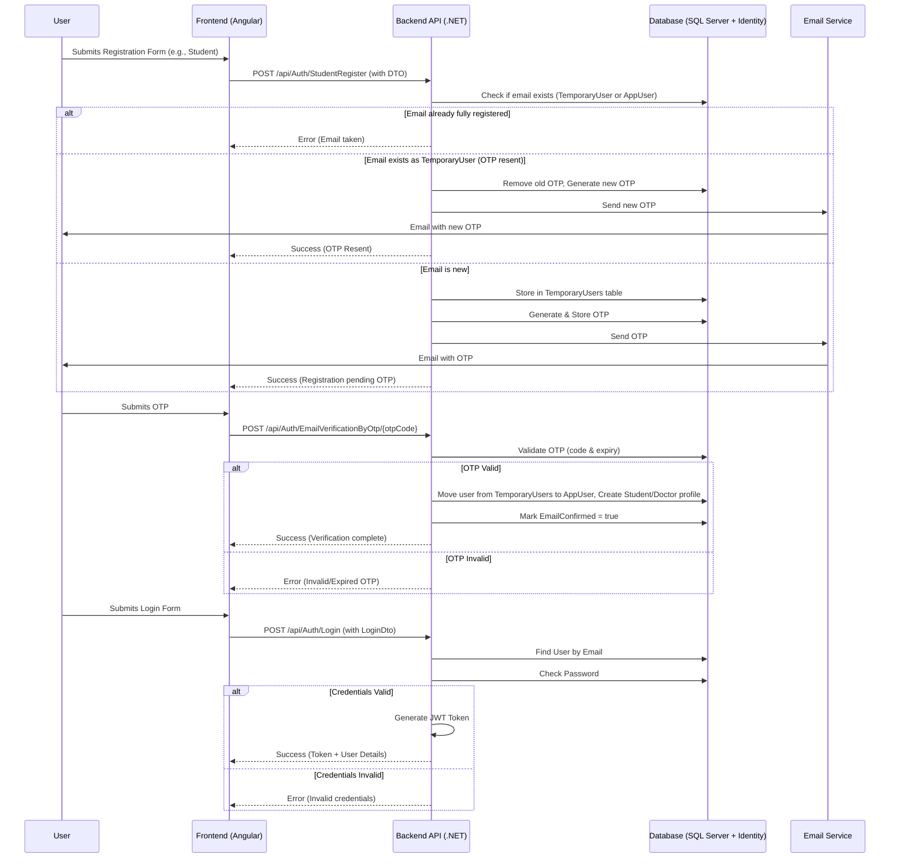

# Diagram

## Mermaid diagram is natively supported

```mermaid


```


```mermaid
sequenceDiagram
    participant U as User
    participant F as Frontend (Angular)
    participant B as Backend API (.NET)
    participant DB as Database (SQL Server + Identity)
    participant EM as Email Service

    U->>F: Submits Registration Form (e.g., Student)
    F->>B: POST /api/Auth/StudentRegister (with DTO)
    B->>DB: Check if email exists (TemporaryUser or AppUser)
    alt Email already fully registered
        B-->>F: Error (Email taken)
    else Email exists as TemporaryUser (OTP resent)
        B->>DB: Remove old OTP, Generate new OTP
        B->>EM: Send new OTP
        EM->>U: Email with new OTP
        B-->>F: Success (OTP Resent)
    else Email is new
        B->>DB: Store in TemporaryUsers table
        B->>DB: Generate & Store OTP
        B->>EM: Send OTP
        EM->>U: Email with OTP
        B-->>F: Success (Registration pending OTP)
    end

    U->>F: Submits OTP
    F->>B: POST /api/Auth/EmailVerificationByOtp/{otpCode}
    B->>DB: Validate OTP (code & expiry)
    alt OTP Valid
        B->>DB: Move user from TemporaryUsers to AppUser, Create Student/Doctor profile
        B->>DB: Mark EmailConfirmed = true
        B-->>F: Success (Verification complete)
    else OTP Invalid
        B-->>F: Error (Invalid/Expired OTP)
    end

    U->>F: Submits Login Form
    F->>B: POST /api/Auth/Login (with LoginDto)
    B->>DB: Find User by Email
    B->>DB: Check Password
    alt Credentials Valid
        B->>B: Generate JWT Token
        B-->>F: Success (Token + User Details)
    else Credentials Invalid
        B-->>F: Error (Invalid credentials)
    end

```

```mermaid
```
