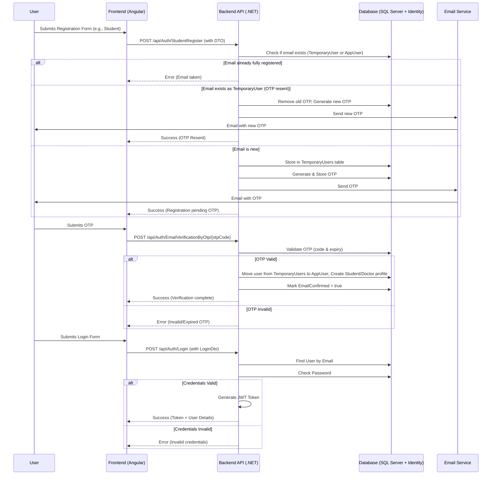
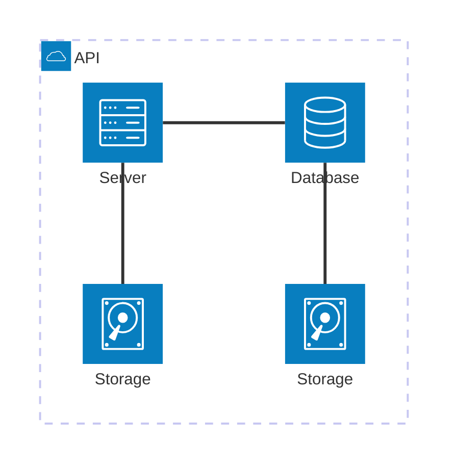

# system design

System Design

This section outlines the high-level architecture, technologies used, data flow, and key modules of the Graduation Projects Grading System.

Architecture Overview

The system follows a client-server architecture:

Frontend (Client): An Angular single-page application (SPA) that provides the user interface for students, doctors, and administrators.

Backend (Server): A .NET Core Web API built with C# that handles business logic, data processing, and API endpoints.

Database: A SQL Server database stores all persistent data, accessed via Entity Framework Core.

Real-time Communication: SignalR is used for real-time features, primarily for notifications.

graph TD
\
A\[Users (Admin, Doctor, Student)] -->|HTTPS| B(Angular Frontend)
\
B -->|REST API Calls (HTTPS/JWT)| C(.NET Core Backend API)
\
C -->|Entity Framework Core| D\[SQL Server Database]
\
C -->|SignalR| E(Notification Hub)
\
E -->|WebSocket/Long Polling| B

Technologies Used
\
Backend

.NET 8 / ASP.NET Core: Framework for building the Web API.

C#: Primary programming language.

Entity Framework Core: Object-Relational Mapper (ORM) for database interaction.

ASP.NET Core Identity: For user authentication and authorization.

JWT (JSON Web Tokens): For securing API endpoints.

SignalR: For real-time bi-directional communication (e.g., notifications).

Swashbuckle (Swagger): For API documentation and testing.

Unit of Work & Generic Repository Pattern: For data access layer abstraction.

Frontend

Angular (latest stable version implied by main.ts and app.config.ts structure): Framework for building the client-side SPA.

TypeScript: Primary programming language.

HTML & CSS: For structuring and styling the user interface.

Angular HttpClient: For making API calls to the backend.

SignalR Client Library for TypeScript/JavaScript: To connect to the SignalR hub.

Quill Editor: For rich text editing (e.g., project descriptions, task details).

Database

SQL Server: Relational database management system.

Development & Deployment (Implied)

Git: For version control.

GitBook: For documentation.

Deployment environments (e.g., Vercel for frontend, Azure/IIS for backend) are not specified but are typical.

Data Flow Diagrams

1. User Registration & Login Flow

2. Project Idea Submission & Review Flow (Simplified)
   \
   graph LR
   \
   subgraph Student/Doctor
   \
   A\[Submit Project Idea via Frontend]
   \
   end
   \
   subgraph Admin/Doctor (Reviewer)
   \
   B\[Review Idea via Frontend]
   \
   end
   \
   A --> C{Backend API}
   \
   C -->|Store Pending (DoctorProjectIdea/TeamProjectIdea)| D\[Database]
   \
   D -->|Fetch for Review| B
   \
   B -->|Approve/Reject via API| C
   \
   C -->|Update Status in DB, Create FinalProjectIdea if approved| D
   \
   C -->|Send Notification| E\[Frontend/User via SignalR]
   \
   IGNORE\_WHEN\_COPYING\_START
   \
   content\_copy
   \
   download
   \
   Use code with caution.
   \
   Mermaid
   \
   IGNORE\_WHEN\_COPYING\_END
3. Evaluation Data Flow
   \
   graph TD
   \
   Admin-->|Create Schedule via Frontend|BackendAPI
   \
   BackendAPI-->|Store Schedule|Database
   \
   Doctor/Admin-->|Fetch Teams & Criteria for Evaluation via Frontend|BackendAPI
   \
   BackendAPI-->|Retrieve Data|Database
   \
   BackendAPI-->|Return Data|Doctor/Admin
   \
   Doctor/Admin-->|Submit Grades via Frontend|BackendAPI
   \
   BackendAPI-->|Store Evaluation Records|Database
   \
   BackendAPI-->|Update Schedule Status|Database
   \
   Student-->|View Grades via Frontend|BackendAPI
   \
   BackendAPI-->|Calculate & Retrieve Grades|Database
   \
   BackendAPI-->|Return Grades|Student
   \
   IGNORE\_WHEN\_COPYING\_START
   \
   content\_copy
   \
   download
   \
   Use code with caution.
   \
   Mermaid
   \
   IGNORE\_WHEN\_COPYING\_END
   \
   Key Modules

The system can be broadly divided into the following logical modules:

Authentication & Authorization Module:

Handles user registration, login, password management, OTP verification.

Manages roles (Admin, Doctor, Student) and permissions.

JWT token generation and validation.

Located primarily in AuthenticationController and IdentityServicesExtension.

User Management Module:

Manages user profiles (Admin, Doctor, Student entities).

Allows users to update their profile information.

Admin can create doctor accounts.

Located in UserProfileController, DoctorsController, StudentsController.

Academic Management Module:

Manages academic years and terms (first/second term start and end dates).

Allows Admins to set the currently active academic year.

Located in AcademicAppointmentsController.

Project Management Module:

Handles submission of project ideas by doctors and student teams.

Manages the review process for these ideas (approval/rejection by Admins/Doctors).

Stores final approved project ideas.

Located in ProjectsController.

Team Management Module:

Allows students to create teams.

Team leaders can invite other students to join their team.

Manages team membership and assigns a supervisor (Doctor) to teams with approved projects.

Located in TeamsController.

Task Management Module:

Doctors (supervisors) can create tasks for their supervised teams/students .

Assigns tasks to specific students within a team.

Tracks task status (Pending, Completed).

Located in TasksController.

Grading & Evaluation Module:

Admins define grading criteria (name, description, max grade, evaluator type, target - student/team, specialty, term).

Admins create evaluation schedules for teams, assigning examiners.

Doctors (Supervisors, Examiners) and Admins submit evaluations based on criteria.

Students can view their calculated grades.

Located in CriteriaController, EvaluationsController, SchedulesController.

Notification Module:

Provides real-time notifications to users via SignalR.

Admins can send system-wide or role-specific notifications.

Users receive notifications for relevant events (e.g., new task, schedule update, project review).

Located in NotificationsController and NotificationHub.

Core & Shared Services:

Database context (GradingManagementSystemDbContext).

Unit of Work and Repositories for data access.

Business logic services (e.g., AuthenticationService, UserProfileService).

DTOs for API communication.

Custom ApiResponse for consistent API responses.

Global exception handling.

some changes happenened
archetecture:

